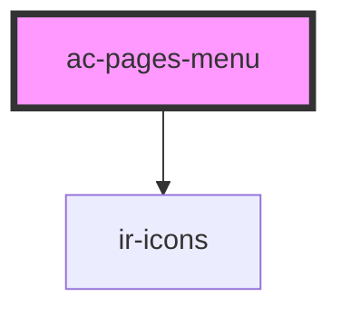

# ac-pages-menu

<!-- Auto Generated Below -->

## Properties

| Property   | Attribute  | Description | Type               | Default |
| ---------- | ---------- | ----------- | ------------------ | ------- |
| `location` | `location` |             | `"nav" \| "sheet"` | `'nav'` |
| `pages`    | --         |             | `ACPages[]`        | `[]`    |

## Events

| Event          | Description | Type                      |
| -------------- | ----------- | ------------------------- |
| `link-clicked` |             | `CustomEvent<MouseEvent>` |

## Dependencies

### Depends on

- [ir-icons](../ui/ir-icons)

### Graph

```mermaid
graph TD;
  ac-pages-menu --> ir-icons
  style ac-pages-menu fill:#f9f,stroke:#333,stroke-width:4px
```

----------------------------------------------

*Built with [StencilJS](https://stenciljs.com/)*
