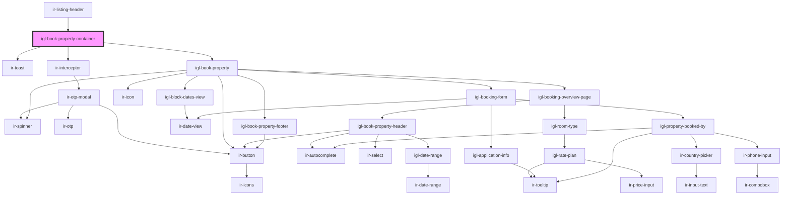

# igl-book-property-container

<!-- Auto Generated Below -->

## Properties

| Property                    | Attribute                       | Description | Type      | Default     |
| --------------------------- | ------------------------------- | ----------- | --------- | ----------- |
| `from_date`                 | `from_date`                     |             | `string`  | `undefined` |
| `language`                  | `language`                      |             | `string`  | `''`        |
| `p`                         | `p`                             |             | `string`  | `undefined` |
| `propertyid`                | `propertyid`                    |             | `number`  | `undefined` |
| `ticket`                    | `ticket`                        |             | `string`  | `''`        |
| `to_date`                   | `to_date`                       |             | `string`  | `undefined` |
| `withIrToastAndInterceptor` | `with-ir-toast-and-interceptor` |             | `boolean` | `true`      |

## Events

| Event              | Description | Type                |
| ------------------ | ----------- | ------------------- |
| `resetBookingData` |             | `CustomEvent<null>` |

## Dependencies

### Used by

 - [ir-listing-header](../ir-booking-listing/ir-listing-header)

### Depends on

- [ir-toast](../ui/ir-toast)
- [ir-interceptor](../ir-interceptor)
- [igl-book-property](../igloo-calendar/igl-book-property)

### Graph

----------------------------------------------

*Built with [StencilJS](https://stenciljs.com/)*
