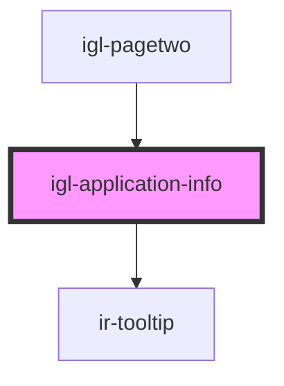

# igl-application-info

<!-- Auto Generated Below -->

## Properties

| Property                 | Attribute                  | Description | Type                        | Default          |
| ------------------------ | -------------------------- | ----------- | --------------------------- | ---------------- |
| `bedPreferenceType`      | --                         |             | `any[]`                     | `[]`             |
| `bookingType`            | `booking-type`             |             | `string`                    | `'PLUS_BOOKING'` |
| `currency`               | `currency`                 |             | `any`                       | `undefined`      |
| `dateDifference`         | `date-difference`          |             | `number`                    | `undefined`      |
| `defaultGuestPreference` | `default-guest-preference` |             | `number`                    | `undefined`      |
| `defaultGuestRoomId`     | `default-guest-room-id`    |             | `number`                    | `undefined`      |
| `guestInfo`              | --                         |             | `{ [key: string]: any; }`   | `undefined`      |
| `guestRefKey`            | `guest-ref-key`            |             | `string`                    | `undefined`      |
| `index`                  | `index`                    |             | `number`                    | `undefined`      |
| `roomsList`              | --                         |             | `{ [key: string]: any; }[]` | `[]`             |
| `selectedUnits`          | --                         |             | `number[]`                  | `[]`             |

## Events

| Event             | Description | Type                                   |
| ----------------- | ----------- | -------------------------------------- |
| `dataUpdateEvent` |             | `CustomEvent<{ [key: string]: any; }>` |

## Dependencies

### Used by

 - [igl-pagetwo](../igl-pagetwo)

### Depends on

- [ir-tooltip](../../ir-tooltip)

### Graph

----------------------------------------------

*Built with [StencilJS](https://stenciljs.com/)*
