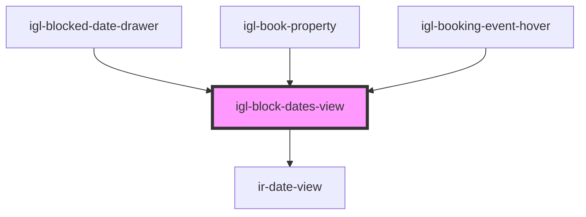

# igl-block-dates-view

<!-- Auto Generated Below -->

## Properties

| Property       | Attribute        | Description | Type                      | Default     |
| -------------- | ---------------- | ----------- | ------------------------- | ----------- |
| `defaultData`  | --               |             | `{ [key: string]: any; }` | `undefined` |
| `entryDate`    | `entry-date`     |             | `string`                  | `undefined` |
| `entryHour`    | `entry-hour`     |             | `number`                  | `undefined` |
| `entryMinute`  | `entry-minute`   |             | `number`                  | `undefined` |
| `fromDate`     | `from-date`      |             | `string`                  | `undefined` |
| `isEventHover` | `is-event-hover` |             | `boolean`                 | `false`     |
| `toDate`       | `to-date`        |             | `string`                  | `undefined` |

## Events

| Event             | Description | Type                                   |
| ----------------- | ----------- | -------------------------------------- |
| `dataUpdateEvent` |             | `CustomEvent<{ [key: string]: any; }>` |

## Dependencies

### Used by

 - [igl-blocked-date-drawer](../igl-blocked-date-drawer)
 - [igl-book-property](../igl-book-property)
 - [igl-booking-event-hover](../igl-booking-event-hover)

### Depends on

- [ir-date-view](../../ir-date-view)

### Graph

----------------------------------------------

*Built with [StencilJS](https://stenciljs.com/)*
