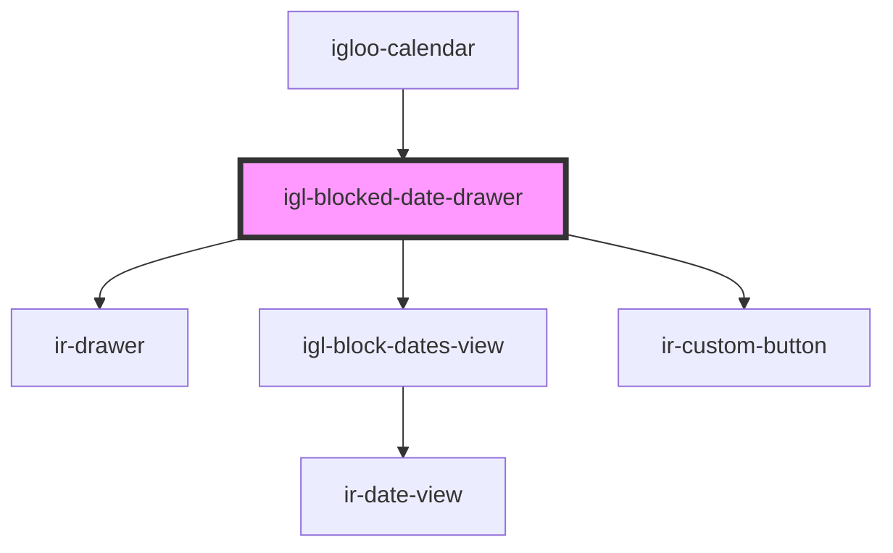

# igl-blocked-date-drawer

<!-- Auto Generated Below -->

## Properties

| Property   | Attribute   | Description                                                                                                                 | Type      | Default     |
| ---------- | ----------- | --------------------------------------------------------------------------------------------------------------------------- | --------- | ----------- |
| `fromDate` | `from-date` | Start date of the blocked date range. Expected to be an ISO date string (YYYY-MM-DD).                                       | `string`  | `undefined` |
| `label`    | `label`     | Label text displayed at the top of the drawer. Typically used as the drawer title.                                          | `string`  | `undefined` |
| `open`     | `open`      | Controls whether the blocked date drawer is open or closed. Reflected to the DOM so it can be styled or toggled externally. | `boolean` | `undefined` |
| `toDate`   | `to-date`   | End date of the blocked date range. Expected to be an ISO date string (YYYY-MM-DD).                                         | `string`  | `undefined` |
| `unitId`   | `unit-id`   | Identifier of the unit being blocked. Used when sending block requests to the booking service.                              | `number`  | `undefined` |

## Events

| Event                     | Description | Type                |
| ------------------------- | ----------- | ------------------- |
| `blockedDateDrawerClosed` |             | `CustomEvent<void>` |

## Dependencies

### Used by

 - [igloo-calendar](..)

### Depends on

- [ir-drawer](../../ir-drawer)
- [igl-block-dates-view](../igl-block-dates-view)
- [ir-custom-button](../../ui/ir-custom-button)

### Graph

----------------------------------------------

*Built with [StencilJS](https://stenciljs.com/)*
