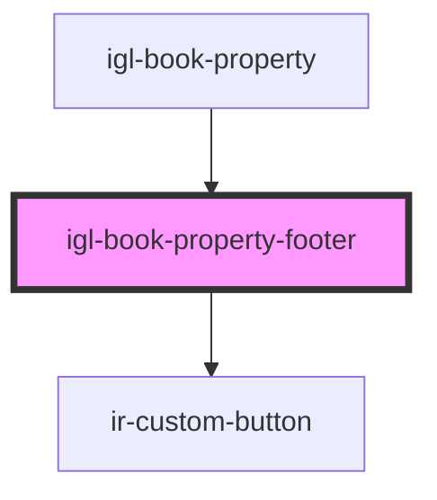

# igl-book-property-footer

<!-- Auto Generated Below -->

## Properties

| Property               | Attribute                   | Description | Type                      | Default     |
| ---------------------- | --------------------------- | ----------- | ------------------------- | ----------- |
| `dateRangeData`        | --                          |             | `{ [key: string]: any; }` | `undefined` |
| `eventType`            | `event-type`                |             | `string`                  | `undefined` |
| `isEditOrAddRoomEvent` | `is-edit-or-add-room-event` |             | `boolean`                 | `undefined` |
| `isLoading`            | `is-loading`                |             | `string`                  | `undefined` |
| `page`                 | `page`                      |             | `string`                  | `undefined` |

## Events

| Event           | Description | Type                                           |
| --------------- | ----------- | ---------------------------------------------- |
| `buttonClicked` |             | `CustomEvent<{ key: TPropertyButtonsTypes; }>` |

## Dependencies

### Used by

 - [igl-book-property](..)

### Depends on

- [ir-custom-button](../../../ui/ir-custom-button)

### Graph

----------------------------------------------

*Built with [StencilJS](https://stenciljs.com/)*
