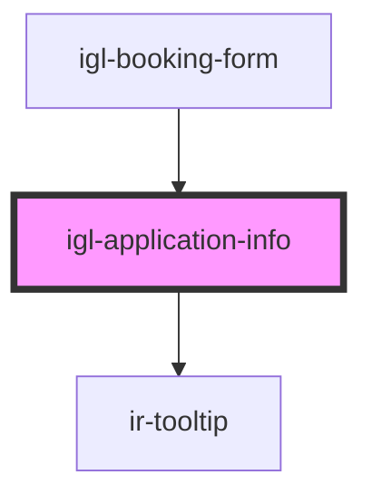

# igl-application-info

<!-- Auto Generated Below -->

## Properties

| Property            | Attribute      | Description | Type                                                           | Default          |
| ------------------- | -------------- | ----------- | -------------------------------------------------------------- | ---------------- |
| `baseData`          | --             |             | `{ unit: { id: string; name: string; }; roomtypeId: number; }` | `undefined`      |
| `bedPreferenceType` | --             |             | `any[]`                                                        | `[]`             |
| `bookingType`       | `booking-type` |             | `string`                                                       | `'PLUS_BOOKING'` |
| `currency`          | --             |             | `ICurrency`                                                    | `undefined`      |
| `guestInfo`         | --             |             | `RatePlanGuest`                                                | `undefined`      |
| `rateplanSelection` | --             |             | `IRatePlanSelection`                                           | `undefined`      |
| `roomIndex`         | `room-index`   |             | `number`                                                       | `undefined`      |
| `totalNights`       | `total-nights` |             | `number`                                                       | `1`              |

## Dependencies

### Used by

 - [igl-booking-form](..)

### Depends on

- [ir-tooltip](../../../../ir-tooltip)

### Graph

----------------------------------------------

*Built with [StencilJS](https://stenciljs.com/)*
