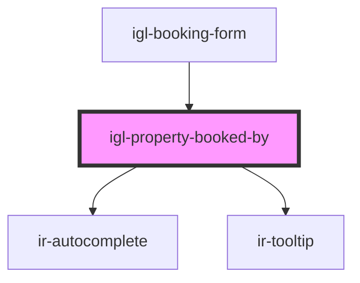

# igl-property-booked-by

<!-- Auto Generated Below -->

## Properties

| Property             | Attribute              | Description | Type                      | Default     |
| -------------------- | ---------------------- | ----------- | ------------------------- | ----------- |
| `countryNodeList`    | --                     |             | `ICountry[]`              | `[]`        |
| `defaultData`        | --                     |             | `{ [key: string]: any; }` | `undefined` |
| `language`           | `language`             |             | `string`                  | `undefined` |
| `propertyId`         | `property-id`          |             | `number`                  | `undefined` |
| `showPaymentDetails` | `show-payment-details` |             | `boolean`                 | `false`     |

## Events

| Event             | Description | Type                                   |
| ----------------- | ----------- | -------------------------------------- |
| `dataUpdateEvent` |             | `CustomEvent<{ [key: string]: any; }>` |

## Dependencies

### Used by

 - [igl-booking-form](..)

### Depends on

- [ir-autocomplete](../../../../ir-autocomplete)
- [ir-tooltip](../../../../ir-tooltip)

### Graph

----------------------------------------------

*Built with [StencilJS](https://stenciljs.com/)*
