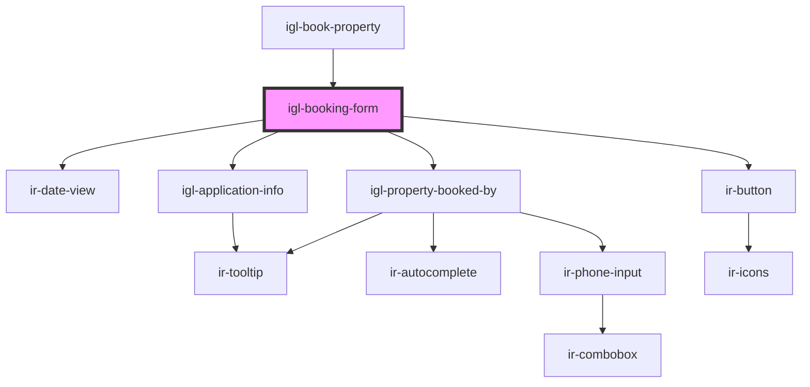

# igl-booking-form

<!-- Auto Generated Below -->

## Properties

| Property                 | Attribute                   | Description | Type                                | Default     |
| ------------------------ | --------------------------- | ----------- | ----------------------------------- | ----------- |
| `bedPreferenceType`      | `bed-preference-type`       |             | `any`                               | `undefined` |
| `bookedByInfoData`       | --                          |             | `{ [key: string]: any; }`           | `undefined` |
| `bookingData`            | --                          |             | `{ [key: string]: any; }`           | `undefined` |
| `countryNodeList`        | `country-node-list`         |             | `any`                               | `undefined` |
| `currency`               | --                          |             | `ICurrency`                         | `undefined` |
| `dateRangeData`          | --                          |             | `{ [key: string]: any; }`           | `undefined` |
| `defaultGuestData`       | --                          |             | `IglBookPropertyPayloadEditBooking` | `undefined` |
| `isEditOrAddRoomEvent`   | `is-edit-or-add-room-event` |             | `boolean`                           | `undefined` |
| `isLoading`              | `is-loading`                |             | `string`                            | `undefined` |
| `language`               | `language`                  |             | `string`                            | `undefined` |
| `propertyId`             | `property-id`               |             | `number`                            | `undefined` |
| `selectedGuestData`      | `selected-guest-data`       |             | `any`                               | `undefined` |
| `selectedRooms`          | --                          |             | `Map<string, Map<string, any>>`     | `undefined` |
| `showPaymentDetails`     | `show-payment-details`      |             | `boolean`                           | `undefined` |
| `showSplitBookingOption` | `show-split-booking-option` |             | `boolean`                           | `undefined` |

## Events

| Event             | Description | Type                                                                    |
| ----------------- | ----------- | ----------------------------------------------------------------------- |
| `buttonClicked`   |             | `CustomEvent<{ key: TPropertyButtonsTypes; data?: CustomEvent<any>; }>` |
| `dataUpdateEvent` |             | `CustomEvent<IPageTwoDataUpdateProps>`                                  |

## Dependencies

### Used by

 - [igl-book-property](..)

### Depends on

- [ir-date-view](../../../ir-date-view)
- [igl-application-info](igl-application-info)
- [igl-property-booked-by](igl-property-booked-by)
- [ir-button](../../../ir-button)

### Graph

----------------------------------------------

*Built with [StencilJS](https://stenciljs.com/)*
