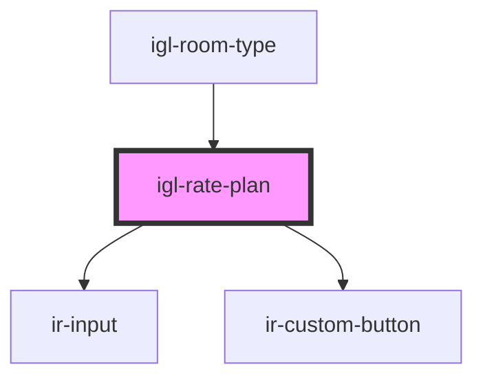

# igl-rate-plan

<!-- Auto Generated Below -->

## Properties

| Property                        | Attribute            | Description | Type                                              | Default          |
| ------------------------------- | -------------------- | ----------- | ------------------------------------------------- | ---------------- |
| `bookingType`                   | `booking-type`       |             | `string`                                          | `'PLUS_BOOKING'` |
| `currency` _(required)_         | --                   |             | `{ symbol: string; }`                             | `undefined`      |
| `isBookDisabled`                | `is-book-disabled`   |             | `boolean`                                         | `false`          |
| `ratePlan`                      | --                   |             | `RatePlan`                                        | `undefined`      |
| `ratePricingMode`               | --                   |             | `{ CODE_NAME: string; CODE_VALUE_EN: string; }[]` | `[]`             |
| `roomTypeId`                    | `room-type-id`       |             | `number`                                          | `undefined`      |
| `shouldBeDisabled` _(required)_ | `should-be-disabled` |             | `boolean`                                         | `undefined`      |
| `visibleInventory` _(required)_ | --                   |             | `IRatePlanSelection`                              | `undefined`      |

## Events

| Event           | Description | Type                                   |
| --------------- | ----------- | -------------------------------------- |
| `buttonClicked` |             | `CustomEvent<{ [key: string]: any; }>` |

## Dependencies

### Used by

 - [igl-room-type](..)

### Depends on

- [ir-input](../../../../../ui/ir-input)
- [ir-custom-button](../../../../../ui/ir-custom-button)

### Graph

----------------------------------------------

*Built with [StencilJS](https://stenciljs.com/)*
