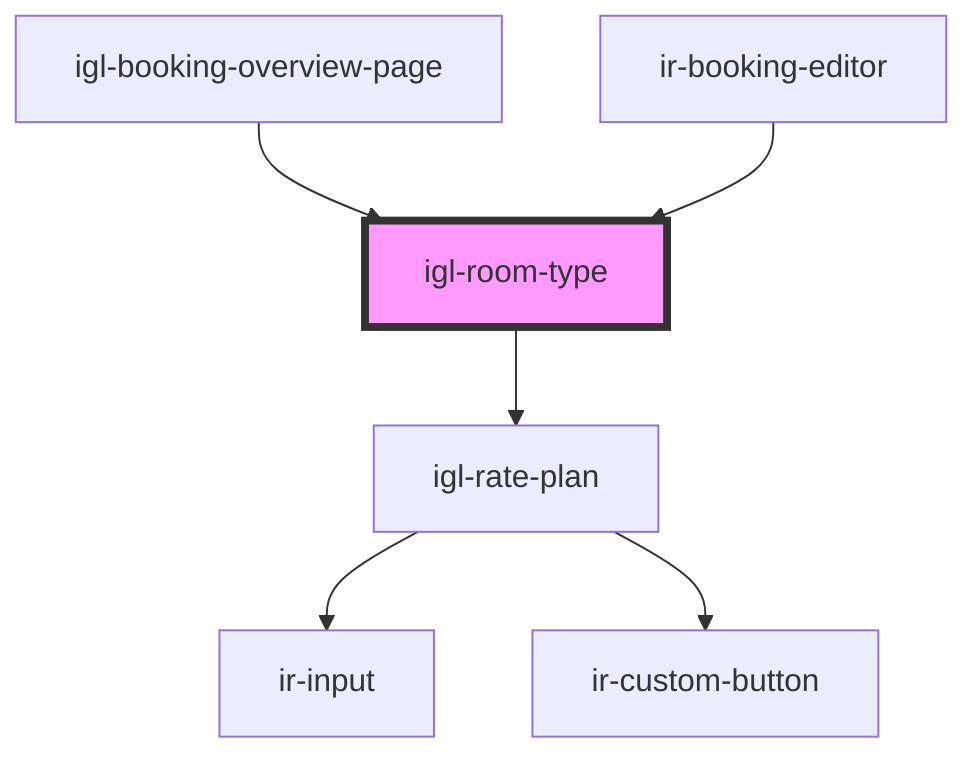

# igl-room-type

<!-- Auto Generated Below -->

## Properties

| Property          | Attribute          | Description | Type       | Default          |
| ----------------- | ------------------ | ----------- | ---------- | ---------------- |
| `bookingType`     | `booking-type`     |             | `string`   | `'PLUS_BOOKING'` |
| `currency`        | `currency`         |             | `any`      | `undefined`      |
| `isBookDisabled`  | `is-book-disabled` |             | `boolean`  | `undefined`      |
| `ratePricingMode` | --                 |             | `any[]`    | `[]`             |
| `roomType`        | --                 |             | `RoomType` | `undefined`      |
| `roomTypeId`      | `room-type-id`     |             | `number`   | `null`           |

## Dependencies

### Used by

 - [igl-booking-overview-page](..)
 - [ir-booking-editor](../../../ir-booking-editor)

### Depends on

- [igl-rate-plan](igl-rate-plan)

### Graph

----------------------------------------------

*Built with [StencilJS](https://stenciljs.com/)*
