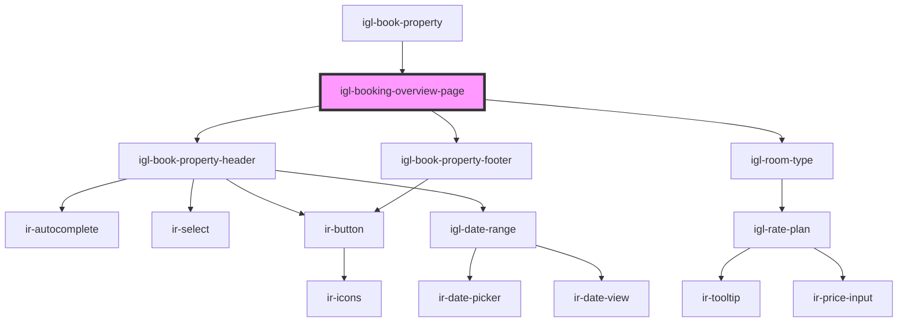

# igl-booking-overview-page

<!-- Auto Generated Below -->

## Properties

| Property                 | Attribute                   | Description | Type                                                                       | Default     |
| ------------------------ | --------------------------- | ----------- | -------------------------------------------------------------------------- | ----------- |
| `adultChildConstraints`  | --                          |             | `{ adult_max_nbr: number; child_max_nbr: number; child_max_age: number; }` | `undefined` |
| `adultChildCount`        | --                          |             | `{ adult: number; child: number; }`                                        | `undefined` |
| `bookedByInfoData`       | `booked-by-info-data`       |             | `any`                                                                      | `undefined` |
| `bookingData`            | `booking-data`              |             | `any`                                                                      | `undefined` |
| `currency`               | `currency`                  |             | `any`                                                                      | `undefined` |
| `dateRangeData`          | `date-range-data`           |             | `any`                                                                      | `undefined` |
| `defaultDaterange`       | --                          |             | `{ from_date: string; to_date: string; }`                                  | `undefined` |
| `eventType`              | `event-type`                |             | `string`                                                                   | `undefined` |
| `initialRoomIds`         | `initial-room-ids`          |             | `any`                                                                      | `undefined` |
| `message`                | `message`                   |             | `string`                                                                   | `undefined` |
| `propertyId`             | `property-id`               |             | `number`                                                                   | `undefined` |
| `ratePricingMode`        | `rate-pricing-mode`         |             | `any`                                                                      | `undefined` |
| `selectedRooms`          | --                          |             | `Map<string, Map<string, any>>`                                            | `undefined` |
| `showSplitBookingOption` | `show-split-booking-option` |             | `boolean`                                                                  | `undefined` |
| `sourceOptions`          | --                          |             | `TSourceOptions[]`                                                         | `undefined` |

## Events

| Event             | Description | Type               |
| ----------------- | ----------- | ------------------ |
| `roomsDataUpdate` |             | `CustomEvent<any>` |

## Dependencies

### Used by

 - [igl-book-property](..)

### Depends on

- [igl-book-property-header](../igl-book-property-header)
- [igl-room-type](igl-room-type)
- [igl-book-property-footer](../igl-book-property-footer)

### Graph

----------------------------------------------

*Built with [StencilJS](https://stenciljs.com/)*
