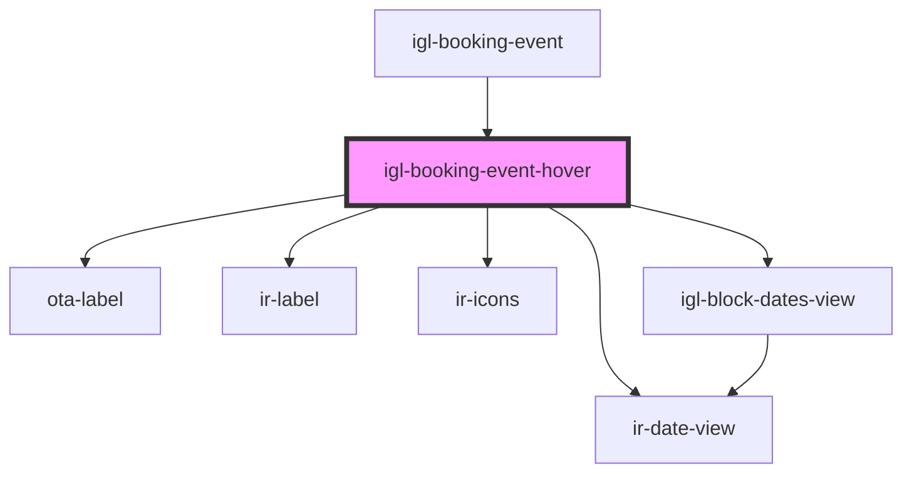

# igl-booking-event-hover

<!-- Auto Generated Below -->

## Properties

| Property             | Attribute            | Description | Type                      | Default     |
| -------------------- | -------------------- | ----------- | ------------------------- | ----------- |
| `bookingEvent`       | --                   |             | `{ [key: string]: any; }` | `undefined` |
| `bubbleInfoTop`      | `bubble-info-top`    |             | `boolean`                 | `false`     |
| `countryNodeList`    | --                   |             | `ICountry[]`              | `undefined` |
| `currency`           | `currency`           |             | `any`                     | `undefined` |
| `is_vacation_rental` | `is_vacation_rental` |             | `boolean`                 | `false`     |

## Events

| Event              | Description | Type                                           |
| ------------------ | ----------- | ---------------------------------------------- |
| `bookingCreated`   |             | `CustomEvent<{ pool?: string; data: any[]; }>` |
| `deleteButton`     |             | `CustomEvent<string>`                          |
| `hideBubbleInfo`   |             | `CustomEvent<any>`                             |
| `showBookingPopup` |             | `CustomEvent<any>`                             |

## Dependencies

### Used by

 - [igl-booking-event](../igl-booking-event)

### Depends on

- [ota-label](../../ui/ota-label)
- [ir-date-view](../../ir-date-view)
- [ir-label](../../ui/ir-label)
- [ir-icons](../../ui/ir-icons)
- [igl-block-dates-view](../igl-block-dates-view)

### Graph

----------------------------------------------

*Built with [StencilJS](https://stenciljs.com/)*
