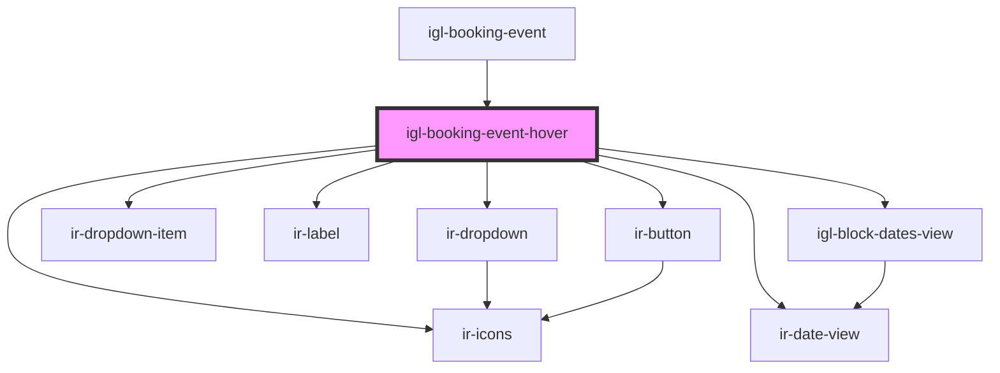

# igl-booking-event-hover

<!-- Auto Generated Below -->

## Properties

| Property             | Attribute            | Description | Type                      | Default     |
| -------------------- | -------------------- | ----------- | ------------------------- | ----------- |
| `bookingEvent`       | --                   |             | `{ [key: string]: any; }` | `undefined` |
| `bubbleInfoTop`      | `bubble-info-top`    |             | `boolean`                 | `false`     |
| `countries`          | --                   |             | `ICountry[]`              | `undefined` |
| `currency`           | `currency`           |             | `any`                     | `undefined` |
| `is_vacation_rental` | `is_vacation_rental` |             | `boolean`                 | `false`     |

## Events

| Event                 | Description | Type                                                                                                                                                                                                                                                                                                                                                                                                   |
| --------------------- | ----------- | ------------------------------------------------------------------------------------------------------------------------------------------------------------------------------------------------------------------------------------------------------------------------------------------------------------------------------------------------------------------------------------------------------ |
| `bookingCreated`      |             | `CustomEvent<{ pool?: string; data: any[]; }>`                                                                                                                                                                                                                                                                                                                                                         |
| `deleteButton`        |             | `CustomEvent<string>`                                                                                                                                                                                                                                                                                                                                                                                  |
| `hideBubbleInfo`      |             | `CustomEvent<any>`                                                                                                                                                                                                                                                                                                                                                                                     |
| `openCalendarSidebar` |             | `CustomEvent<{ type: "split" \| "room-guests" \| "booking-details" \| "add-days" \| "bulk-blocks"; payload: any; }>`                                                                                                                                                                                                                                                                                   |
| `showBookingPopup`    |             | `CustomEvent<any>`                                                                                                                                                                                                                                                                                                                                                                                     |
| `showDialog`          |             | `CustomEvent<{ reason: "checkin"; bookingNumber: string; roomIdentifier: string; roomUnit: string; roomName: string; sidebarPayload: RoomGuestsPayload & { bookingNumber: string; }; } \| { reason: "checkout"; bookingNumber: string; roomIdentifier: string; roomUnit: string; roomName: string; } \| { reason: "reallocate"; } & IReallocationPayload \| { reason: "stretch"; } & IRoomNightsData>` |

## Dependencies

### Used by

 - [igl-booking-event](../igl-booking-event)

### Depends on

- [ir-dropdown](../../ui/ir-dropdown)
- [ir-icons](../../ui/ir-icons)
- [ir-dropdown-item](../../ui/ir-dropdown-item)
- [ir-date-view](../../ir-date-view)
- [ir-label](../../ui/ir-label)
- [ir-button](../../ui/ir-button)
- [igl-block-dates-view](../igl-block-dates-view)

### Graph

----------------------------------------------

*Built with [StencilJS](https://stenciljs.com/)*
