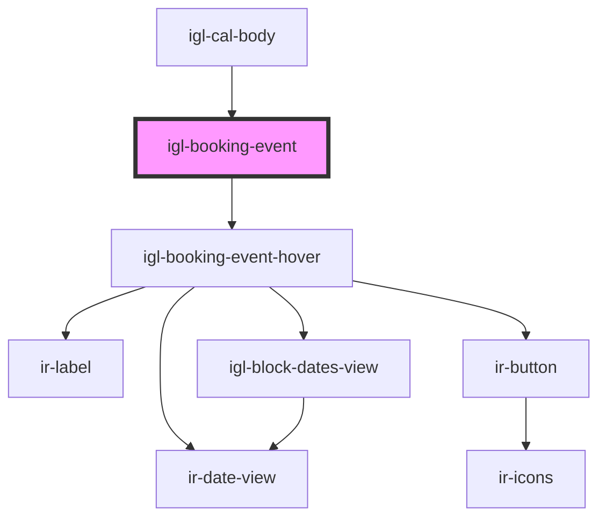

# igl-booking-event

<!-- Auto Generated Below -->

## Properties

| Property             | Attribute            | Description | Type                      | Default     |
| -------------------- | -------------------- | ----------- | ------------------------- | ----------- |
| `allBookingEvents`   | --                   |             | `{ [key: string]: any; }` | `[]`        |
| `bookingEvent`       | --                   |             | `{ [key: string]: any; }` | `undefined` |
| `countries`          | --                   |             | `ICountry[]`              | `undefined` |
| `currency`           | `currency`           |             | `any`                     | `undefined` |
| `is_vacation_rental` | `is_vacation_rental` |             | `boolean`                 | `false`     |
| `language`           | `language`           |             | `string`                  | `undefined` |

## Events

| Event                   | Description | Type                                                                                                                                                                                                                                                                                                                                                                                                   |
| ----------------------- | ----------- | ------------------------------------------------------------------------------------------------------------------------------------------------------------------------------------------------------------------------------------------------------------------------------------------------------------------------------------------------------------------------------------------------------ |
| `dragOverEventData`     |             | `CustomEvent<any>`                                                                                                                                                                                                                                                                                                                                                                                     |
| `hideBubbleInfo`        |             | `CustomEvent<any>`                                                                                                                                                                                                                                                                                                                                                                                     |
| `resetStretchedBooking` |             | `CustomEvent<string>`                                                                                                                                                                                                                                                                                                                                                                                  |
| `showDialog`            |             | `CustomEvent<{ reason: "checkin"; bookingNumber: string; roomIdentifier: string; roomUnit: string; roomName: string; sidebarPayload: RoomGuestsPayload & { bookingNumber: string; }; } \| { reason: "checkout"; bookingNumber: string; roomIdentifier: string; roomUnit: string; roomName: string; } \| { reason: "reallocate"; } & IReallocationPayload \| { reason: "stretch"; } & IRoomNightsData>` |
| `showRoomNightsDialog`  |             | `CustomEvent<IRoomNightsData>`                                                                                                                                                                                                                                                                                                                                                                         |
| `toast`                 |             | `CustomEvent<ICustomToast & Partial<IToastWithButton> \| IDefaultToast & Partial<IToastWithButton>>`                                                                                                                                                                                                                                                                                                   |
| `updateBookingEvent`    |             | `CustomEvent<{ [key: string]: any; }>`                                                                                                                                                                                                                                                                                                                                                                 |
| `updateEventData`       |             | `CustomEvent<any>`                                                                                                                                                                                                                                                                                                                                                                                     |

## Dependencies

### Used by

 - [igl-cal-body](../igl-cal-body)

### Depends on

- [igl-booking-event-hover](../igl-booking-event-hover)

### Graph

----------------------------------------------

*Built with [StencilJS](https://stenciljs.com/)*
