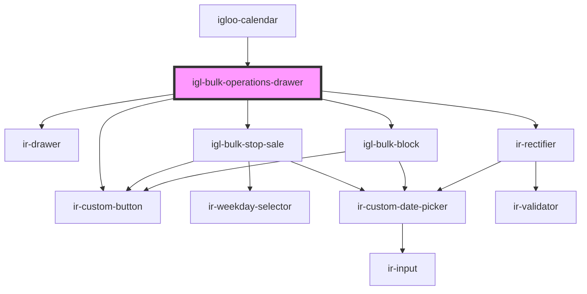

# igl-bulk-operations-drawer

<!-- Auto Generated Below -->

## Properties

| Property         | Attribute          | Description | Type      | Default     |
| ---------------- | ------------------ | ----------- | --------- | ----------- |
| `maxDatesLength` | `max-dates-length` |             | `number`  | `8`         |
| `open`           | `open`             |             | `boolean` | `undefined` |
| `property_id`    | `property_id`      |             | `number`  | `undefined` |

## Events

| Event         | Description | Type                   |
| ------------- | ----------- | ---------------------- |
| `closeDrawer` |             | `CustomEvent<null>`    |
| `toast`       |             | `CustomEvent<IrToast>` |

## Dependencies

### Used by

 - [igloo-calendar](../..)

### Depends on

- [ir-drawer](../../../ir-drawer)
- [igl-bulk-stop-sale](../igl-bulk-stop-sale)
- [igl-bulk-block](../igl-bulk-block)
- [ir-rectifier](../ir-rectifier)
- [ir-custom-button](../../../ui/ir-custom-button)

### Graph

----------------------------------------------

*Built with [StencilJS](https://stenciljs.com/)*
