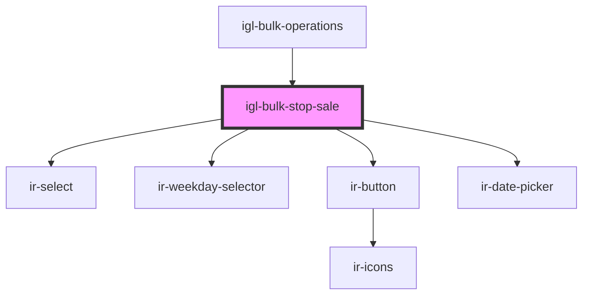

# igl-bulk-stop-sale

<!-- Auto Generated Below -->

## Properties

| Property         | Attribute          | Description | Type     | Default     |
| ---------------- | ------------------ | ----------- | -------- | ----------- |
| `maxDatesLength` | `max-dates-length` |             | `number` | `8`         |
| `property_id`    | `property_id`      |             | `number` | `undefined` |

## Events

| Event        | Description | Type                                                                                                 |
| ------------ | ----------- | ---------------------------------------------------------------------------------------------------- |
| `closeModal` |             | `CustomEvent<null>`                                                                                  |
| `toast`      |             | `CustomEvent<ICustomToast & Partial<IToastWithButton> \| IDefaultToast & Partial<IToastWithButton>>` |

## Dependencies

### Used by

 - [igl-bulk-operations](..)

### Depends on

- [ir-select](../../../ui/ir-select)
- [ir-weekday-selector](../../../ui/ir-weekday-selector)
- [ir-button](../../../ui/ir-button)
- [ir-date-picker](../../../ui/ir-date-picker)

### Graph

----------------------------------------------

*Built with [StencilJS](https://stenciljs.com/)*
