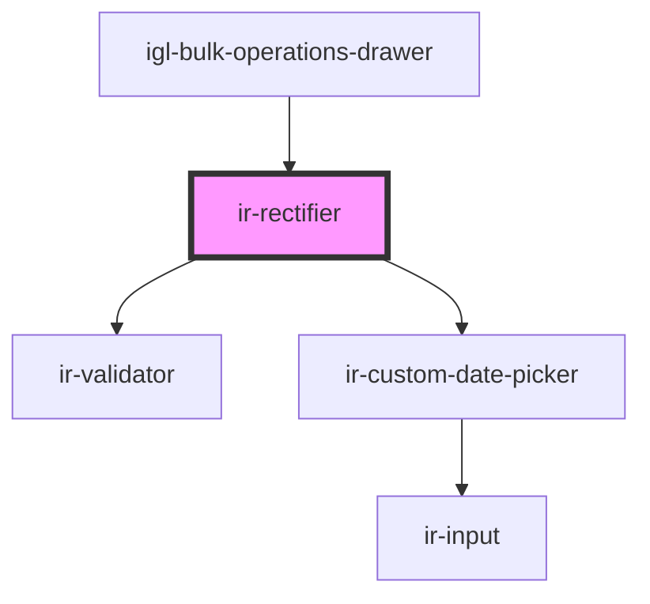

# ir-rectifier

<!-- Auto Generated Below -->

## Properties

| Property | Attribute | Description | Type     | Default     |
| -------- | --------- | ----------- | -------- | ----------- |
| `formId` | `form-id` |             | `string` | `undefined` |

## Events

| Event            | Description | Type                                                                                                 |
| ---------------- | ----------- | ---------------------------------------------------------------------------------------------------- |
| `closeDrawer`    |             | `CustomEvent<void>`                                                                                  |
| `loadingChanged` |             | `CustomEvent<boolean>`                                                                               |
| `toast`          |             | `CustomEvent<ICustomToast & Partial<IToastWithButton> \| IDefaultToast & Partial<IToastWithButton>>` |

## Dependencies

### Used by

 - [igl-bulk-operations-drawer](../igl-bulk-operations-drawer)

### Depends on

- [ir-validator](../../../ui/ir-validator)
- [ir-custom-date-picker](../../../ir-custom-date-picker)

### Graph

----------------------------------------------

*Built with [StencilJS](https://stenciljs.com/)*
