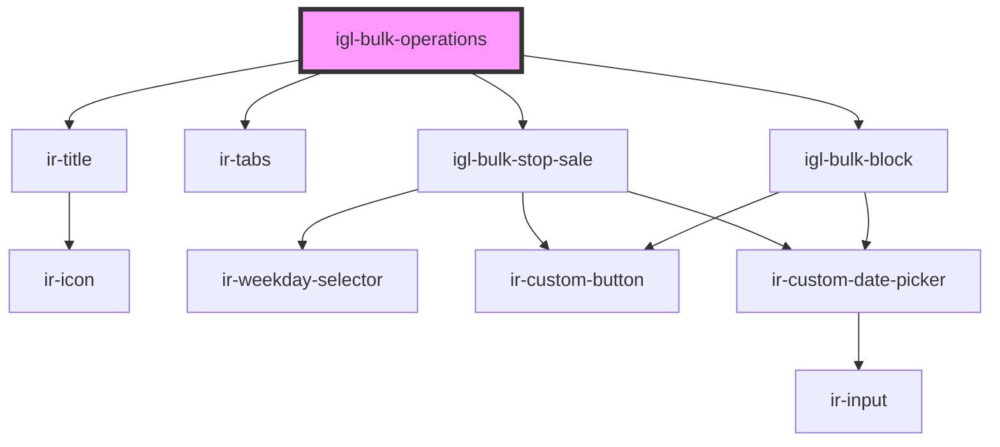

# igl-bulk-operations

<!-- Auto Generated Below -->

## Properties

| Property         | Attribute          | Description | Type     | Default     |
| ---------------- | ------------------ | ----------- | -------- | ----------- |
| `maxDatesLength` | `max-dates-length` |             | `number` | `8`         |
| `property_id`    | `property_id`      |             | `number` | `undefined` |

## Events

| Event        | Description | Type                   |
| ------------ | ----------- | ---------------------- |
| `closeModal` |             | `CustomEvent<null>`    |
| `toast`      |             | `CustomEvent<IrToast>` |

## Dependencies

### Depends on

- [ir-title](../../ir-title)
- [ir-tabs](../../ui/ir-tabs)
- [igl-bulk-stop-sale](igl-bulk-stop-sale)
- [igl-bulk-block](igl-bulk-block)

### Graph

----------------------------------------------

*Built with [StencilJS](https://stenciljs.com/)*
