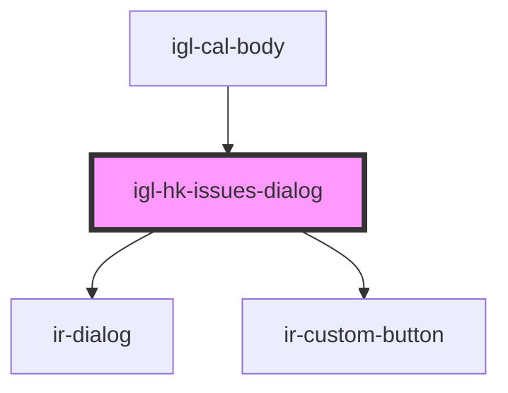

# igl-hk-issues-dialog

<!-- Auto Generated Below -->

## Properties

| Property     | Attribute     | Description | Type        | Default     |
| ------------ | ------------- | ----------- | ----------- | ----------- |
| `issues`     | --            |             | `HKIssue[]` | `undefined` |
| `open`       | `open`        |             | `boolean`   | `false`     |
| `propertyId` | `property-id` |             | `number`    | `undefined` |
| `unitId`     | `unit-id`     |             | `number`    | `undefined` |
| `unitName`   | `unit-name`   |             | `string`    | `undefined` |

## Events

| Event          | Description | Type                |
| -------------- | ----------- | ------------------- |
| `irAfterClose` |             | `CustomEvent<void>` |

## Dependencies

### Used by

 - [igl-cal-body](..)

### Depends on

- [ir-dialog](../../../ui/ir-dialog)
- [ir-custom-button](../../../ui/ir-custom-button)

### Graph

----------------------------------------------

*Built with [StencilJS](https://stenciljs.com/)*
