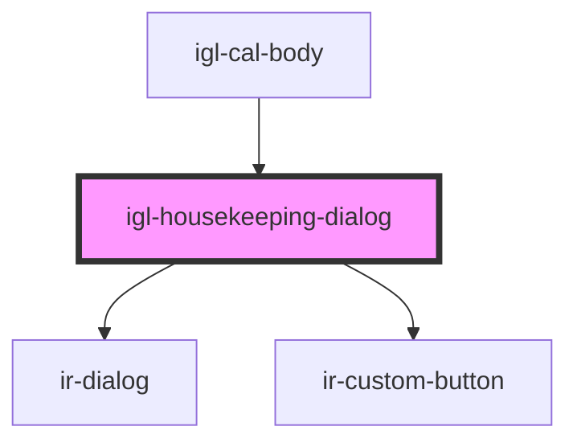

# igl-housekeeping-dialog

<!-- Auto Generated Below -->

## Properties

| Property        | Attribute        | Description                                                                                           | Type           | Default     |
| --------------- | ---------------- | ----------------------------------------------------------------------------------------------------- | -------------- | ----------- |
| `bookingNumber` | `booking-number` | Booking number associated with the selected room (if any). Used for housekeeping action tracking.     | `number`       | `undefined` |
| `open`          | `open`           | Controls whether the dialog is open. The parent component is responsible for toggling this value.     | `boolean`      | `undefined` |
| `propertyId`    | `property-id`    | Current property identifier. Required for housekeeping service requests.                              | `number`       | `undefined` |
| `selectedRoom`  | --               | Currently selected room for housekeeping actions. When null or undefined, the dialog will not render. | `PhysicalRoom` | `undefined` |

## Events

| Event          | Description                        | Type                |
| -------------- | ---------------------------------- | ------------------- |
| `irAfterClose` | Fired after dialog is fully closed | `CustomEvent<void>` |

## Dependencies

### Used by

 - [igl-cal-body](..)

### Depends on

- [ir-dialog](../../../ui/ir-dialog)
- [ir-custom-button](../../../ui/ir-custom-button)

### Graph

----------------------------------------------

*Built with [StencilJS](https://stenciljs.com/)*
