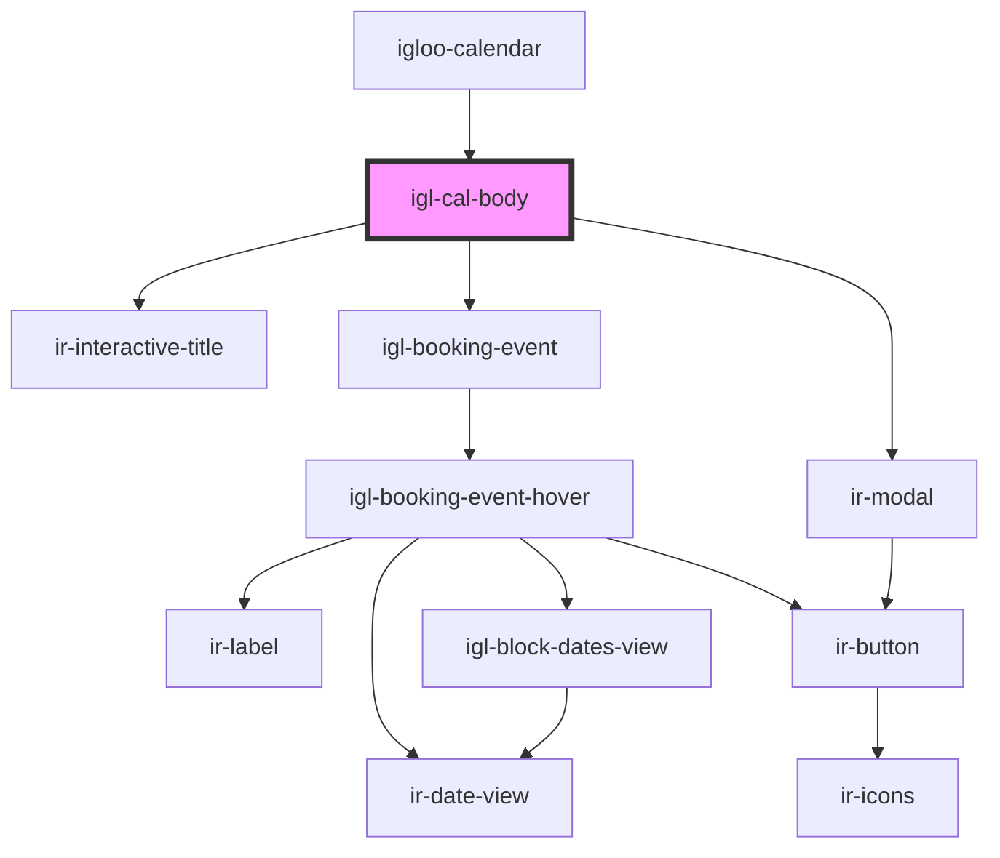

# igl-cal-body

<!-- Auto Generated Below -->

## Properties

| Property               | Attribute                 | Description | Type                      | Default     |
| ---------------------- | ------------------------- | ----------- | ------------------------- | ----------- |
| `calendarData`         | --                        |             | `{ [key: string]: any; }` | `undefined` |
| `countries`            | --                        |             | `ICountry[]`              | `undefined` |
| `currency`             | `currency`                |             | `any`                     | `undefined` |
| `highlightedDate`      | `highlighted-date`        |             | `string`                  | `undefined` |
| `isScrollViewDragging` | `is-scroll-view-dragging` |             | `boolean`                 | `undefined` |
| `language`             | `language`                |             | `string`                  | `undefined` |
| `propertyId`           | `property-id`             |             | `number`                  | `undefined` |
| `today`                | --                        |             | `String`                  | `undefined` |

## Events

| Event                  | Description | Type                 |
| ---------------------- | ----------- | -------------------- |
| `addBookingDatasEvent` |             | `CustomEvent<any[]>` |
| `scrollPageToRoom`     |             | `CustomEvent<any>`   |
| `showBookingPopup`     |             | `CustomEvent<any>`   |

## Dependencies

### Used by

 - [igloo-calendar](..)

### Depends on

- [ir-interactive-title](../../ui/ir-interactive-title)
- [igl-booking-event](../igl-booking-event)
- [ir-modal](../../ui/ir-modal)

### Graph

----------------------------------------------

*Built with [StencilJS](https://stenciljs.com/)*
