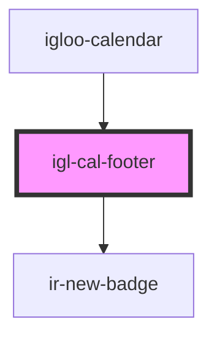

# igl-cal-footer

<!-- Auto Generated Below -->

## Properties

| Property          | Attribute          | Description | Type                      | Default     |
| ----------------- | ------------------ | ----------- | ------------------------- | ----------- |
| `calendarData`    | --                 |             | `{ [key: string]: any; }` | `undefined` |
| `highlightedDate` | `highlighted-date` |             | `string`                  | `undefined` |
| `today`           | --                 |             | `String`                  | `undefined` |

## Events

| Event         | Description | Type                                   |
| ------------- | ----------- | -------------------------------------- |
| `optionEvent` |             | `CustomEvent<{ [key: string]: any; }>` |

## Dependencies

### Used by

 - [igloo-calendar](..)

### Depends on

- [ir-new-badge](../../ir-new-badge)

### Graph

----------------------------------------------

*Built with [StencilJS](https://stenciljs.com/)*
