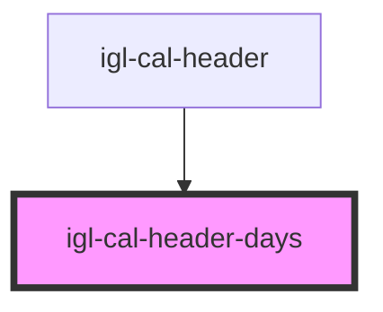

# igl-cal-header-days

<!-- Auto Generated Below -->

## Overview

The `.headersContainer` sticky bar of `igl-cal-header`: the month row plus the per-day header
cells (unassigned-units badge, day title, occupancy percent). `.headersContainer`/`.headerCell`
and each cell's `data-day` attribute are read directly by `igloo-calendar.tsx`'s drag-bounds
calculation (`document.querySelectorAll('.headersContainer .headerCell')`) — do not rename them.

## Properties

| Property                | Attribute            | Description                                                                                             | Type                         | Default     |
| ----------------------- | -------------------- | ------------------------------------------------------------------------------------------------------- | ---------------------------- | ----------- |
| `days`                  | --                   |                                                                                                         | `DayInfo[]`                  | `[]`        |
| `highlightedDate`       | `highlighted-date`   |                                                                                                         | `string`                     | `undefined` |
| `isVacationRental`      | `is-vacation-rental` |                                                                                                         | `boolean`                    | `undefined` |
| `monthsInfo`            | --                   |                                                                                                         | `MonthInfo[]`                | `[]`        |
| `today`                 | --                   |                                                                                                         | `String`                     | `undefined` |
| `unassignedRoomsNumber` | --                   | Unassigned-unit counts keyed by `dayInfo.day`, falling back to `dayInfo.unassigned_units_nbr` per cell. | `{ [key: string]: number; }` | `{}`        |

## Events

| Event             | Description                                                                               | Type                                              |
| ----------------- | ----------------------------------------------------------------------------------------- | ------------------------------------------------- |
| `dayBadgeClicked` | Emitted only when a badge with a non-zero count is clicked — a zero-count badge is inert. | `CustomEvent<{ day: string; currentDate: any; }>` |

## Dependencies

### Used by

 - [igl-cal-header](..)

### Graph

----------------------------------------------

*Built with [StencilJS](https://stenciljs.com/)*
