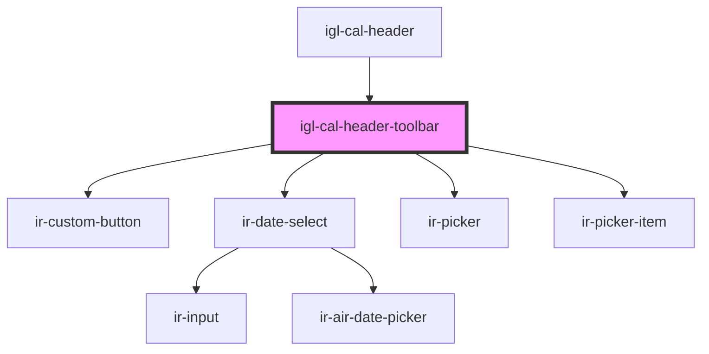

# igl-cal-header-toolbar

<!-- Auto Generated Below -->

## Overview

The `.topLeftCell` sticky bar of `igl-cal-header`: unassigned-units / day-use-bookings buttons,
date navigation, rectifier and stop/open-sale buttons, and the room-search picker. `.topLeftCell`
is read directly by `igloo-calendar.tsx`'s drag-bounds calculation
(`document.querySelector('igl-cal-header .topLeftCell')`) — do not rename it.

## Properties

| Property           | Attribute             | Description | Type             | Default     |
| ------------------ | --------------------- | ----------- | ---------------- | ----------- |
| `isVacationRental` | `is-vacation-rental`  |             | `boolean`        | `undefined` |
| `minDate`          | `min-date`            |             | `string`         | `undefined` |
| `roomsList`        | --                    |             | `RoomListItem[]` | `[]`        |
| `showDayUseButton` | `show-day-use-button` |             | `boolean`        | `undefined` |

## Events

| Event            | Description                                                                                           | Type                                        |
| ---------------- | ----------------------------------------------------------------------------------------------------- | ------------------------------------------- |
| `actionSelected` | All toolbar-button actions, keyed the same way the existing `optionEvent` payload's `key` already is. | `CustomEvent<{ key: string; data?: any; }>` |
| `roomSelected`   |                                                                                                       | `CustomEvent<{ roomId: number; }>`          |

## Dependencies

### Used by

 - [igl-cal-header](..)

### Depends on

- [ir-custom-button](../../../ui/ir-custom-button)
- [ir-date-select](../../../ui/date-picker/ir-date-select)
- [ir-picker](../../../ui/ir-picker)
- [ir-picker-item](../../../ui/ir-picker/ir-picker-item)

### Graph

----------------------------------------------

*Built with [StencilJS](https://stenciljs.com/)*
