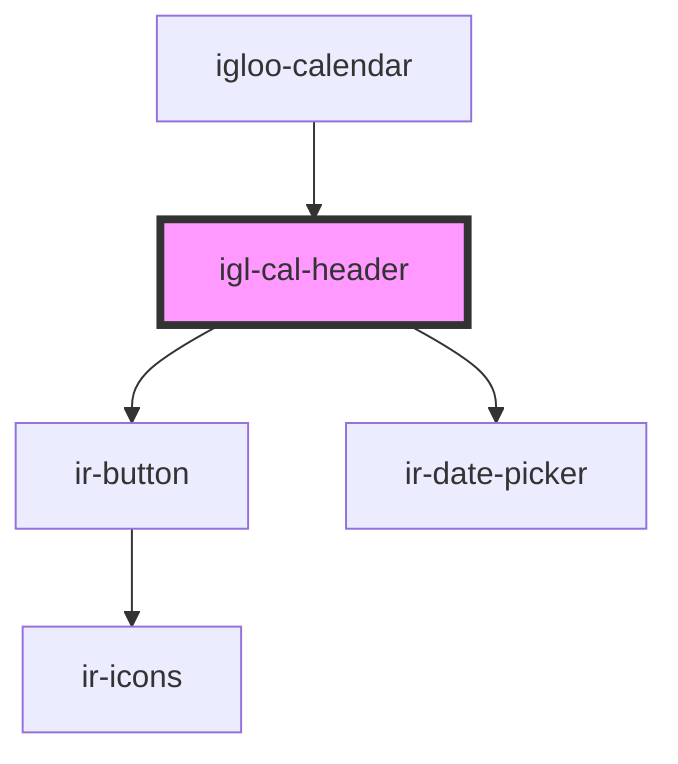

# igl-cal-header

<!-- Auto Generated Below -->

## Properties

| Property          | Attribute          | Description | Type                      | Default     |
| ----------------- | ------------------ | ----------- | ------------------------- | ----------- |
| `calendarData`    | --                 |             | `{ [key: string]: any; }` | `undefined` |
| `highlightedDate` | `highlighted-date` |             | `string`                  | `undefined` |
| `propertyid`      | `propertyid`       |             | `number`                  | `undefined` |
| `to_date`         | `to_date`          |             | `string`                  | `undefined` |
| `today`           | --                 |             | `String`                  | `undefined` |
| `unassignedDates` | `unassigned-dates` |             | `any`                     | `undefined` |

## Events

| Event                  | Description | Type                                   |
| ---------------------- | ----------- | -------------------------------------- |
| `gotoRoomEvent`        |             | `CustomEvent<{ [key: string]: any; }>` |
| `gotoToBeAssignedDate` |             | `CustomEvent<{ [key: string]: any; }>` |
| `optionEvent`          |             | `CustomEvent<{ [key: string]: any; }>` |

## Dependencies

### Used by

 - [igloo-calendar](..)

### Depends on

- [ir-button](../../ui/ir-button)
- [ir-date-picker](../../ui/ir-date-picker)

### Graph

----------------------------------------------

*Built with [StencilJS](https://stenciljs.com/)*
