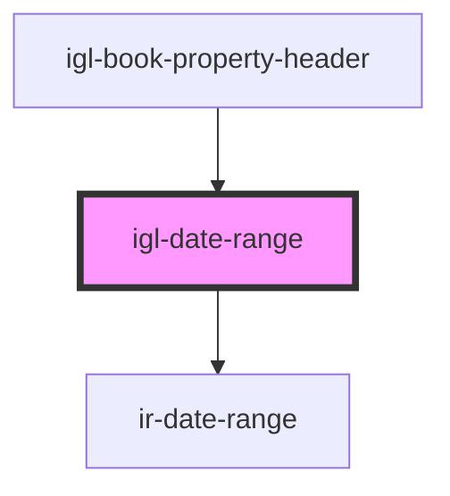

# igl-date-range

<!-- Auto Generated Below -->

## Properties

| Property             | Attribute              | Description | Type                      | Default     |
| -------------------- | ---------------------- | ----------- | ------------------------- | ----------- |
| `dateLabel`          | `date-label`           |             | `string`                  | `undefined` |
| `defaultData`        | --                     |             | `{ [key: string]: any; }` | `undefined` |
| `disabled`           | `disabled`             |             | `boolean`                 | `false`     |
| `maxDate`            | `max-date`             |             | `string`                  | `undefined` |
| `minDate`            | `min-date`             |             | `string`                  | `undefined` |
| `variant`            | `variant`              |             | `"booking" \| "default"`  | `'default'` |
| `withDateDifference` | `with-date-difference` |             | `boolean`                 | `true`      |

## Events

| Event             | Description | Type                                                                                                 |
| ----------------- | ----------- | ---------------------------------------------------------------------------------------------------- |
| `dateSelectEvent` |             | `CustomEvent<{ [key: string]: any; }>`                                                               |
| `toast`           |             | `CustomEvent<ICustomToast & Partial<IToastWithButton> \| IDefaultToast & Partial<IToastWithButton>>` |

## Dependencies

### Used by

 - [igl-book-property-header](../igl-book-property/igl-book-property-header)

### Depends on

- [ir-date-range](../../ui/ir-date-range)

### Graph

----------------------------------------------

*Built with [StencilJS](https://stenciljs.com/)*
