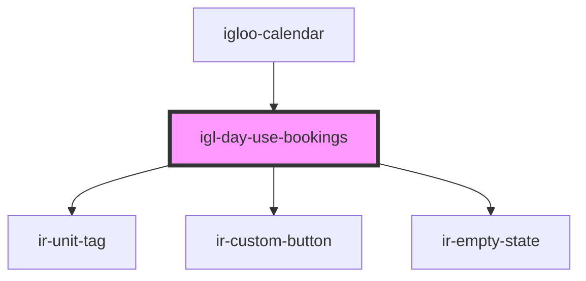

# igl-day-use-bookings

<!-- Auto Generated Below -->

## Properties

| Property         | Attribute | Description                                                                                                                                                 | Type                      | Default     |
| ---------------- | --------- | ----------------------------------------------------------------------------------------------------------------------------------------------------------- | ------------------------- | ----------- |
| `calendarData`   | --        |                                                                                                                                                             | `{ [key: string]: any; }` | `undefined` |
| `dayUseBookings` | --        | Day-use bookings for whatever calendar window has been loaded (from `getDayUseBookingsForCalendar`) — same source `igl-cal-body` uses for its cell markers. | `DayUseBookings[]`        | `[]`        |

## Events

| Event              | Description | Type                                   |
| ------------------ | ----------- | -------------------------------------- |
| `optionEvent`      |             | `CustomEvent<{ [key: string]: any; }>` |
| `showBookingPopup` |             | `CustomEvent<{ [key: string]: any; }>` |

## Dependencies

### Used by

 - [igloo-calendar](..)

### Depends on

- [ir-unit-tag](../../ir-unit-tag)
- [ir-custom-button](../../ui/ir-custom-button)
- [ir-empty-state](../../ir-empty-state)

### Graph

----------------------------------------------

*Built with [StencilJS](https://stenciljs.com/)*
