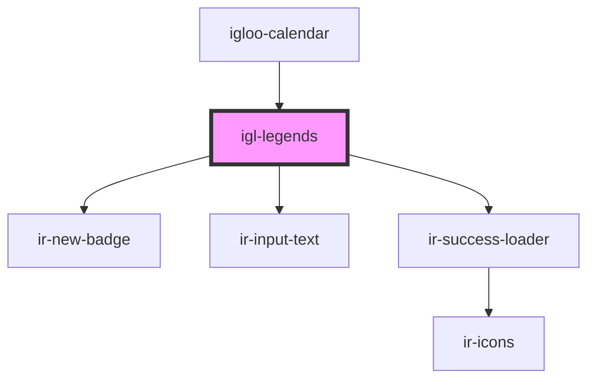

# igl-legends

<!-- Auto Generated Below -->

## Properties

| Property     | Attribute | Description | Type                      | Default     |
| ------------ | --------- | ----------- | ------------------------- | ----------- |
| `legendData` | --        |             | `{ [key: string]: any; }` | `undefined` |

## Events

| Event         | Description | Type                                   |
| ------------- | ----------- | -------------------------------------- |
| `optionEvent` |             | `CustomEvent<{ [key: string]: any; }>` |

## Dependencies

### Used by

 - [igloo-calendar](..)

### Depends on

- [ir-new-badge](../../ir-new-badge)
- [ir-input-text](../../ui/ir-input-text)
- [ir-success-loader](../../ui/ir-success-loader)

### Graph

----------------------------------------------

*Built with [StencilJS](https://stenciljs.com/)*
