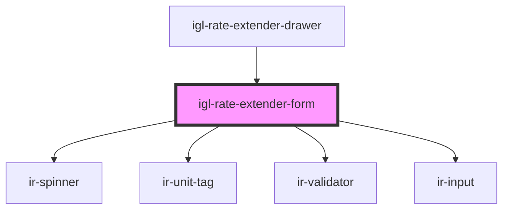

# igl-rate-extender-form

<!-- Auto Generated Below -->

## Properties

| Property        | Attribute        | Description | Type                                      | Default     |
| --------------- | ---------------- | ----------- | ----------------------------------------- | ----------- |
| `bookingNumber` | `booking-number` |             | `string`                                  | `undefined` |
| `defaultDates`  | --               |             | `{ from_date: string; to_date: string; }` | `undefined` |
| `fromDate`      | `from-date`      |             | `string`                                  | `undefined` |
| `identifier`    | `identifier`     |             | `string`                                  | `undefined` |
| `language`      | `language`       |             | `string`                                  | `undefined` |
| `pool`          | `pool`           |             | `string`                                  | `undefined` |
| `propertyId`    | `property-id`    |             | `number`                                  | `undefined` |
| `toDate`        | `to-date`        |             | `string`                                  | `undefined` |

## Events

| Event                   | Description                                                                                | Type                                       |
| ----------------------- | ------------------------------------------------------------------------------------------ | ------------------------------------------ |
| `availabilityChanged`   | Emits whether inventory is available for the additional nights (false when there is none). | `CustomEvent<boolean>`                     |
| `closeRoomNightsDialog` |                                                                                            | `CustomEvent<IRoomNightsDataEventPayload>` |
| `loadingChanged`        |                                                                                            | `CustomEvent<boolean>`                     |

## Dependencies

### Used by

 - [igl-rate-extender-drawer](..)

### Depends on

- [ir-spinner](../../../ui/ir-spinner)
- [ir-unit-tag](../../../ir-unit-tag)
- [ir-validator](../../../ui/ir-validator)
- [ir-input](../../../ui/ir-input)

### Graph

----------------------------------------------

*Built with [StencilJS](https://stenciljs.com/)*
