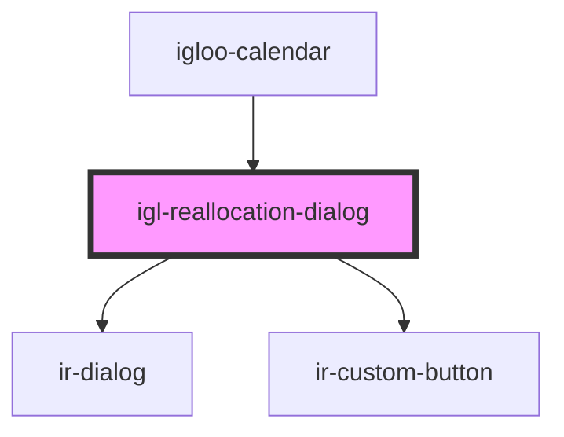

# igl-reallocation-dialog

<!-- Auto Generated Below -->

## Properties

| Property | Attribute | Description | Type                   | Default     |
| -------- | --------- | ----------- | ---------------------- | ----------- |
| `data`   | --        |             | `IReallocationPayload` | `undefined` |

## Events

| Event             | Description | Type                   |
| ----------------- | ----------- | ---------------------- |
| `dialogClose`     |             | `CustomEvent<boolean>` |
| `resetModalState` |             | `CustomEvent<void>`    |
| `revertBooking`   |             | `CustomEvent<string>`  |

## Dependencies

### Used by

 - [igloo-calendar](..)

### Depends on

- [ir-dialog](../../ui/ir-dialog)
- [ir-custom-button](../../ui/ir-custom-button)

### Graph

----------------------------------------------

*Built with [StencilJS](https://stenciljs.com/)*
