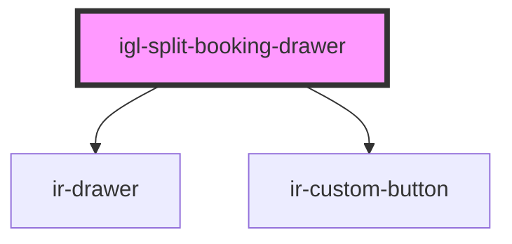

# igl-split-booking-drawer

<!-- Auto Generated Below -->

## Properties

| Property     | Attribute    | Description | Type      | Default     |
| ------------ | ------------ | ----------- | --------- | ----------- |
| `booking`    | --           |             | `Booking` | `undefined` |
| `identifier` | `identifier` |             | `string`  | `undefined` |
| `open`       | `open`       |             | `boolean` | `undefined` |

## Events

| Event        | Description | Type                |
| ------------ | ----------- | ------------------- |
| `closeModal` |             | `CustomEvent<null>` |

## Dependencies

### Depends on

- [ir-drawer](../../ir-drawer)
- [ir-custom-button](../../ui/ir-custom-button)

### Graph

----------------------------------------------

*Built with [StencilJS](https://stenciljs.com/)*
