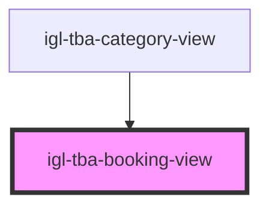

# igl-tba-booking-view

<!-- Auto Generated Below -->

## Properties

| Property        | Attribute        | Description | Type                      | Default     |
| --------------- | ---------------- | ----------- | ------------------------- | ----------- |
| `calendarData`  | --               |             | `{ [key: string]: any; }` | `undefined` |
| `categoryIndex` | `category-index` |             | `number`                  | `undefined` |
| `eventIndex`    | `event-index`    |             | `number`                  | `undefined` |
| `room`          | --               |             | `UnassignedRoomEntry`     | `undefined` |
| `roomTypeId`    | `room-type-id`   |             | `number`                  | `undefined` |
| `roomTypeName`  | `room-type-name` |             | `string`                  | `undefined` |
| `selectedDate`  | `selected-date`  |             | `string`                  | `undefined` |

## Events

| Event                               | Description | Type                                                                                                                                                       |
| ----------------------------------- | ----------- | ---------------------------------------------------------------------------------------------------------------------------------------------------------- |
| `addToBeAssignedEvent`              |             | `CustomEvent<{ key: "tobeAssignedEvents"; data: (CalendarUnitPreviewEvent \| CalendarAssignedEvent)[]; }>`                                                 |
| `assignRoomEvent`                   |             | `CustomEvent<CalendarAssignedEvent>`                                                                                                                       |
| `highlightToBeAssignedBookingEvent` |             | `CustomEvent<{ key: "highlightBookingId"; data: { bookingId: string; fromDate?: string; }; }>`                                                             |
| `openCalendarSidebar`               |             | `CustomEvent<{ type: "split" \| "room-guests" \| "booking-details" \| "add-days" \| "bulk-blocks" \| "reallocate-drawer" \| "rectifier"; payload: any; }>` |
| `scrollPageToRoom`                  |             | `CustomEvent<{ key: "scrollPageToRoom"; id: number; refClass: string; }>`                                                                                  |

## Dependencies

### Used by

 - [igl-tba-category-view](../igl-tba-category-view)

### Graph

```mermaid
graph TD;
  igl-tba-category-view --> igl-tba-booking-view
  style igl-tba-booking-view fill:#f9f,stroke:#333,stroke-width:4px
```

----------------------------------------------

*Built with [StencilJS](https://stenciljs.com/)*
