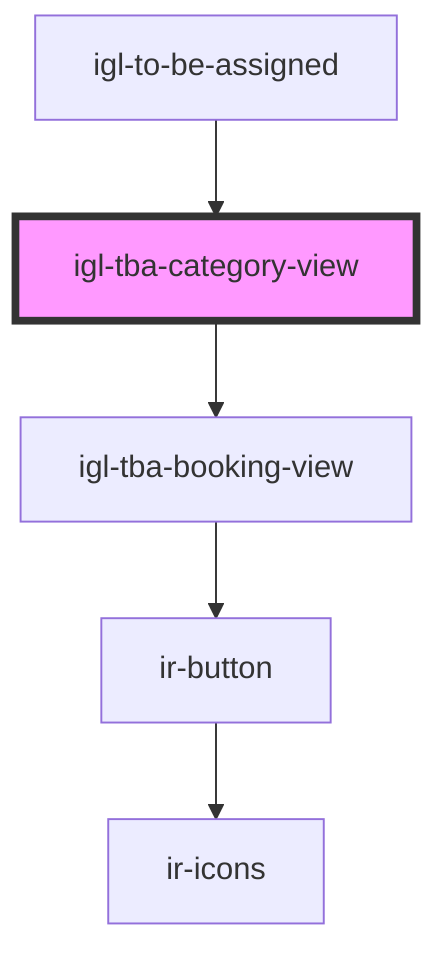

# igl-tba-category-view

<!-- Auto Generated Below -->

## Properties

| Property         | Attribute        | Description | Type                      | Default     |
| ---------------- | ---------------- | ----------- | ------------------------- | ----------- |
| `calendarData`   | --               |             | `{ [key: string]: any; }` | `undefined` |
| `categoriesData` | --               |             | `{ [key: string]: any; }` | `{}`        |
| `categoryId`     | `category-id`    |             | `any`                     | `undefined` |
| `categoryIndex`  | `category-index` |             | `any`                     | `undefined` |
| `eventDatas`     | `event-datas`    |             | `any`                     | `undefined` |
| `selectedDate`   | `selected-date`  |             | `any`                     | `undefined` |

## Events

| Event             | Description | Type                                   |
| ----------------- | ----------- | -------------------------------------- |
| `assignUnitEvent` |             | `CustomEvent<{ [key: string]: any; }>` |

## Dependencies

### Used by

 - [igl-to-be-assigned](..)

### Depends on

- [igl-tba-booking-view](../igl-tba-booking-view)

### Graph

----------------------------------------------

*Built with [StencilJS](https://stenciljs.com/)*
