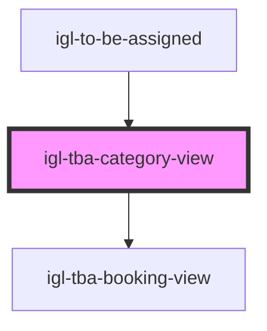

# igl-tba-category-view

<!-- Auto Generated Below -->

## Properties

| Property        | Attribute        | Description | Type                      | Default     |
| --------------- | ---------------- | ----------- | ------------------------- | ----------- |
| `calendarData`  | --               |             | `{ [key: string]: any; }` | `undefined` |
| `category`      | --               |             | `UnassignedCategory`      | `undefined` |
| `categoryIndex` | `category-index` |             | `number`                  | `undefined` |
| `selectedDate`  | `selected-date`  |             | `string`                  | `undefined` |

## Events

| Event             | Description | Type                                   |
| ----------------- | ----------- | -------------------------------------- |
| `assignUnitEvent` |             | `CustomEvent<{ identifier: string; }>` |

## Dependencies

### Used by

 - [igl-to-be-assigned](..)

### Depends on

- [igl-tba-booking-view](../igl-tba-booking-view)

### Graph

```mermaid
graph TD;
  igl-tba-category-view --> igl-tba-booking-view
  igl-to-be-assigned --> igl-tba-category-view
  style igl-tba-category-view fill:#f9f,stroke:#333,stroke-width:4px
```

----------------------------------------------

*Built with [StencilJS](https://stenciljs.com/)*
