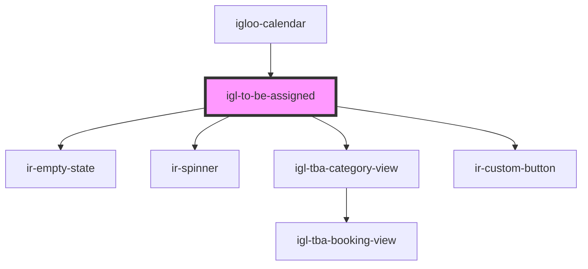

# igl-to-be-assigned

<!-- Auto Generated Below -->

## Properties

| Property       | Attribute    | Description | Type                      | Default     |
| -------------- | ------------ | ----------- | ------------------------- | ----------- |
| `calendarData` | --           |             | `{ [key: string]: any; }` | `undefined` |
| `propertyid`   | `propertyid` |             | `number`                  | `undefined` |

## Events

| Event                               | Description | Type                                                                        |
| ----------------------------------- | ----------- | --------------------------------------------------------------------------- |
| `addToBeAssignedEvent`              |             | `CustomEvent<{ key: "tobeAssignedEvents"; data: []; }>`                     |
| `highlightToBeAssignedBookingEvent` |             | `CustomEvent<{ key: "highlightBookingId"; data: { bookingId: string; }; }>` |
| `optionEvent`                       |             | `CustomEvent<{ key: string; data?: unknown; }>`                             |
| `showBookingPopup`                  |             | `CustomEvent<{ key: "calendar"; data: number; noScroll: boolean; }>`        |

## Dependencies

### Used by

 - [igloo-calendar](..)

### Depends on

- [ir-empty-state](../../ir-empty-state)
- [ir-spinner](../../ui/ir-spinner)
- [igl-tba-category-view](igl-tba-category-view)
- [ir-custom-button](../../ui/ir-custom-button)

### Graph

----------------------------------------------

*Built with [StencilJS](https://stenciljs.com/)*
