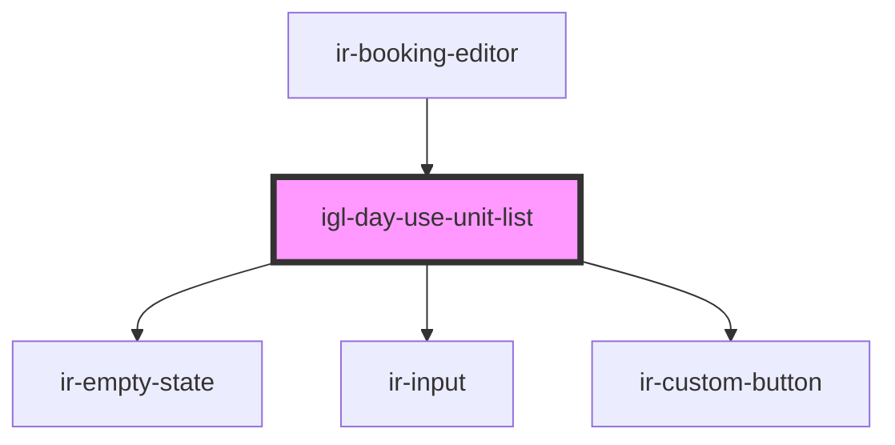

# igl-day-use-unit-list

<!-- Auto Generated Below -->

## Properties

| Property              | Attribute           | Description                                                                                                                                                                                                                                                                                   | Type                                                                                                                                                                                                                                                                                                                                                                                                                                                                                                                                                                                                                                                                                                                                                                                                                                                                                                                                                                                                                                                                                                                                                                                                                                                                                                                                            | Default     |
| --------------------- | ------------------- | --------------------------------------------------------------------------------------------------------------------------------------------------------------------------------------------------------------------------------------------------------------------------------------------- | ----------------------------------------------------------------------------------------------------------------------------------------------------------------------------------------------------------------------------------------------------------------------------------------------------------------------------------------------------------------------------------------------------------------------------------------------------------------------------------------------------------------------------------------------------------------------------------------------------------------------------------------------------------------------------------------------------------------------------------------------------------------------------------------------------------------------------------------------------------------------------------------------------------------------------------------------------------------------------------------------------------------------------------------------------------------------------------------------------------------------------------------------------------------------------------------------------------------------------------------------------------------------------------------------------------------------------------------------- | ----------- |
| `bookedUnitIds`       | --                  | Unit ids already booked for day use on the target date (from `getDayUseBookingsForCalendar`) — excluded from the list.                                                                                                                                                                        | `Set<number>`                                                                                                                                                                                                                                                                                                                                                                                                                                                                                                                                                                                                                                                                                                                                                                                                                                                                                                                                                                                                                                                                                                                                                                                                                                                                                                                                   | `new Set()` |
| `currency`            | `currency`          |                                                                                                                                                                                                                                                                                               | `any`                                                                                                                                                                                                                                                                                                                                                                                                                                                                                                                                                                                                                                                                                                                                                                                                                                                                                                                                                                                                                                                                                                                                                                                                                                                                                                                                           | `undefined` |
| `currentExtraService` | --                  | The day-use extra service currently being edited (`ir-booking-editor` `mode="EDIT_DAY_USE"`). Its unit is exempt from `bookedUnitIds` (it's its own existing booking, not a conflict), never shows the upcoming-check-in warning (same reason), gets its price prefilled, and is highlighted. | `{ description?: string; currency_id?: number; agent?: { name?: string; id?: number; email?: string; property_id?: any; code?: string; address?: string; agent_rate_type_code?: { code?: string; description?: string; }; agent_type_code?: { code?: string; description?: string; }; city?: string; contact_name?: string; contract_nbr?: any; country_id?: number; currency_id?: any; due_balance?: any; email_copied_upon_booking?: string; is_active?: boolean; is_send_guest_confirmation_email?: boolean; notes?: string; payment_mode?: { code?: string; description?: string; }; phone?: string; provided_discount?: any; question?: string; sort_order?: any; tax_nbr?: string; reference?: string; verification_mode?: string; has_opening_balance?: boolean; cl_post_timing?: { code?: string; description?: string; }; pr_id?: number; }; system_id?: number; room_identifier?: string; booking_system_id?: number; cost?: number; end_date?: string; start_date?: string; price?: number; category?: { code?: string; }; pr_id?: number; from_time?: string; to_time?: string; charges?: { city_tax_amount?: number; city_tax_percent?: number; net_amount?: number; service_charge_amount?: number; service_charge_percent?: number; tax_amount?: number; total_amount?: number; vat_amount?: number; vat_percent?: number; }; }` | `undefined` |
| `hasSearched`         | `has-searched`      | Whether an availability check has completed at least once — distinguishes "no search yet" (render nothing) from "searched, zero units" (show empty state).                                                                                                                                    | `boolean`                                                                                                                                                                                                                                                                                                                                                                                                                                                                                                                                                                                                                                                                                                                                                                                                                                                                                                                                                                                                                                                                                                                                                                                                                                                                                                                                       | `false`     |
| `mode`                | `mode`              |                                                                                                                                                                                                                                                                                               | `"ADD_ROOM" \| "BAR_BOOKING" \| "EDIT_BOOKING" \| "EDIT_DAY_USE" \| "PLUS_BOOKING" \| "SPLIT_BOOKING"`                                                                                                                                                                                                                                                                                                                                                                                                                                                                                                                                                                                                                                                                                                                                                                                                                                                                                                                                                                                                                                                                                                                                                                                                                                          | `undefined` |
| `netPrice`            | `net-price`         | Net (tax-exclusive) version of the resolved gross default price, pre-computed by the parent (`calculateNetAmount`) — shown as the input's default value so an untouched default reads the same way a typed custom (net) amount does.                                                          | `number`                                                                                                                                                                                                                                                                                                                                                                                                                                                                                                                                                                                                                                                                                                                                                                                                                                                                                                                                                                                                                                                                                                                                                                                                                                                                                                                                        | `null`      |
| `price`               | `price`             | Fallback day-use price used only if the property has no `SVC_DEFAULT_PRICE_DUZ` configured, editable per unit.                                                                                                                                                                                | `number`                                                                                                                                                                                                                                                                                                                                                                                                                                                                                                                                                                                                                                                                                                                                                                                                                                                                                                                                                                                                                                                                                                                                                                                                                                                                                                                                        | `undefined` |
| `resolvingUnitId`     | `resolving-unit-id` | Unit id currently being resolved (gross-price lookup) after "Book" was clicked — disables the other buttons.                                                                                                                                                                                  | `number`                                                                                                                                                                                                                                                                                                                                                                                                                                                                                                                                                                                                                                                                                                                                                                                                                                                                                                                                                                                                                                                                                                                                                                                                                                                                                                                                        | `null`      |
| `roomTypes`           | --                  | Room types returned by the day-use availability check.                                                                                                                                                                                                                                        | `RoomType[]`                                                                                                                                                                                                                                                                                                                                                                                                                                                                                                                                                                                                                                                                                                                                                                                                                                                                                                                                                                                                                                                                                                                                                                                                                                                                                                                                    | `[]`        |
| `unitId`              | `unit-id`           | When a specific unit was preselected (e.g. double-click on a room title in the calendar), only that unit is shown.                                                                                                                                                                            | `number \| string`                                                                                                                                                                                                                                                                                                                                                                                                                                                                                                                                                                                                                                                                                                                                                                                                                                                                                                                                                                                                                                                                                                                                                                                                                                                                                                                              | `undefined` |

## Events

| Event          | Description | Type                                                                                              |
| -------------- | ----------- | ------------------------------------------------------------------------------------------------- |
| `unitSelected` |             | `CustomEvent<{ unit: PhysicalRoom; roomType: RoomType; price: number; isCustomPrice: boolean; }>` |

## Dependencies

### Used by

 - [ir-booking-editor](..)

### Depends on

- [ir-empty-state](../../../ir-empty-state)
- [ir-input](../../../ui/ir-input)
- [ir-custom-button](../../../ui/ir-custom-button)

### Graph

----------------------------------------------

*Built with [StencilJS](https://stenciljs.com/)*
