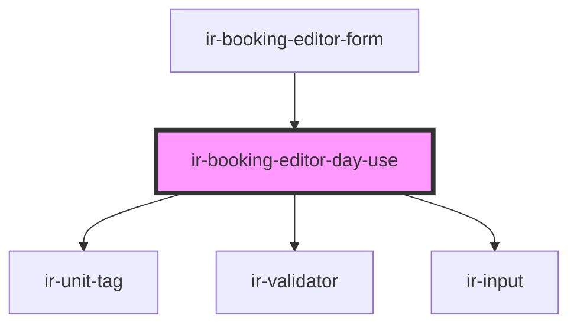

# ir-booking-editor-day-use

<!-- Auto Generated Below -->

## Overview

Owns the day-use-only parts of the booking editor form: the selected unit's summary
(date, room type, unit, price, same-day movement status) and the hours picker. Rendered
by `ir-booking-editor-form` only when `booking_store.bookingDraft.dayUse` is true.

## Dependencies

### Used by

 - [ir-booking-editor-form](../ir-booking-editor-form)

### Depends on

- [ir-unit-tag](../../../ir-unit-tag)
- [ir-validator](../../../ui/ir-validator)
- [ir-input](../../../ui/ir-input)

### Graph

----------------------------------------------

*Built with [StencilJS](https://stenciljs.com/)*
