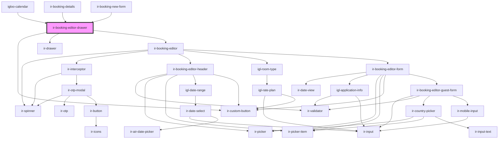

# ir-booking-editor-drawer

<!-- Auto Generated Below -->

## Properties

| Property         | Attribute         | Description                                    | Type                                                                                                                                                                    | Default          |
| ---------------- | ----------------- | ---------------------------------------------- | ----------------------------------------------------------------------------------------------------------------------------------------------------------------------- | ---------------- |
| `blockedUnit`    | --                | Payload for blocked unit dates.                | `{ RELEASE_AFTER_HOURS: string; ENTRY_DATE: string; ENTRY_HOUR: number; ENTRY_MINUTE: number; OPTIONAL_REASON: string; STATUS_CODE: string; OUT_OF_SERVICE: boolean; }` | `undefined`      |
| `booking`        | --                | Booking being created or edited.               | `Booking`                                                                                                                                                               | `undefined`      |
| `checkIn`        | `check-in`        | Check-in date (ISO string).                    | `string`                                                                                                                                                                | `undefined`      |
| `checkOut`       | `check-out`       | Check-out date (ISO string).                   | `string`                                                                                                                                                                | `undefined`      |
| `label`          | `label`           | Optional drawer title override.                | `string`                                                                                                                                                                | `undefined`      |
| `language`       | `language`        | UI language code (default: `en`).              | `string`                                                                                                                                                                | `'en'`           |
| `mode`           | `mode`            | Current booking editor mode.                   | `"ADD_ROOM" \| "BAR_BOOKING" \| "EDIT_BOOKING" \| "PLUS_BOOKING" \| "SPLIT_BOOKING"`                                                                                    | `'PLUS_BOOKING'` |
| `open`           | `open`            | Controls drawer visibility (reflected to DOM). | `boolean`                                                                                                                                                               | `undefined`      |
| `propertyid`     | `propertyid`      | Property identifier.                           | `string`                                                                                                                                                                | `undefined`      |
| `roomIdentifier` | `room-identifier` | Room identifier used by the editor.            | `string`                                                                                                                                                                | `undefined`      |
| `roomTypeIds`    | --                | Allowed room type identifiers.                 | `(string \| number)[]`                                                                                                                                                  | `[]`             |
| `ticket`         | `ticket`          | Auth token used for API requests.              | `string`                                                                                                                                                                | `undefined`      |
| `unitId`         | `unit-id`         | Selected unit identifier.                      | `string`                                                                                                                                                                | `undefined`      |

## Events

| Event                 | Description                                       | Type                |
| --------------------- | ------------------------------------------------- | ------------------- |
| `bookingEditorClosed` | Emitted when the booking editor drawer is closed. | `CustomEvent<void>` |

## Dependencies

### Used by

 - [igloo-calendar](../..)
 - [ir-booking-details](../../../ir-booking-details)
 - [ir-booking-new-form](../../../ir-booking-new-form)

### Depends on

- [ir-custom-button](../../../ui/ir-custom-button)
- [ir-drawer](../../../ir-drawer)
- [ir-booking-editor](..)

### Graph

----------------------------------------------

*Built with [StencilJS](https://stenciljs.com/)*
