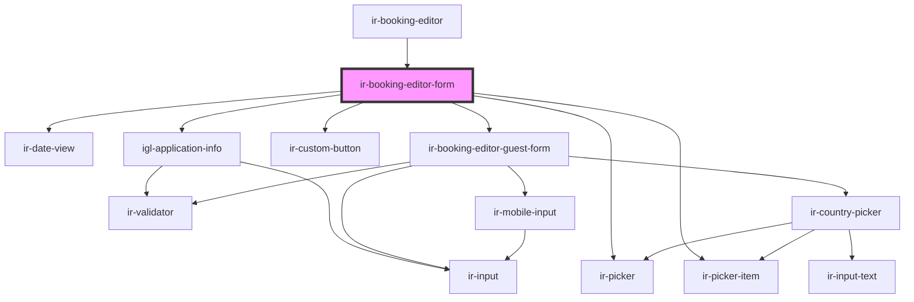

# ir-booking-editor-form

<!-- Auto Generated Below -->

## Properties

| Property | Attribute | Description | Type                                                                                 | Default          |
| -------- | --------- | ----------- | ------------------------------------------------------------------------------------ | ---------------- |
| `mode`   | `mode`    |             | `"ADD_ROOM" \| "BAR_BOOKING" \| "EDIT_BOOKING" \| "PLUS_BOOKING" \| "SPLIT_BOOKING"` | `'PLUS_BOOKING'` |
| `room`   | --        |             | `Room`                                                                               | `undefined`      |

## Events

| Event           | Description | Type                  |
| --------------- | ----------- | --------------------- |
| `doReservation` |             | `CustomEvent<string>` |

## Dependencies

### Used by

 - [ir-booking-editor](..)

### Depends on

- [ir-date-view](../../../ir-date-view)
- [igl-application-info](../../igl-book-property/igl-booking-form/igl-application-info)
- [ir-picker](../../../ui/ir-picker)
- [ir-picker-item](../../../ui/ir-picker/ir-picker-item)
- [ir-custom-button](../../../ui/ir-custom-button)
- [ir-booking-editor-guest-form](../ir-booking-editor-guest-form)

### Graph

----------------------------------------------

*Built with [StencilJS](https://stenciljs.com/)*
