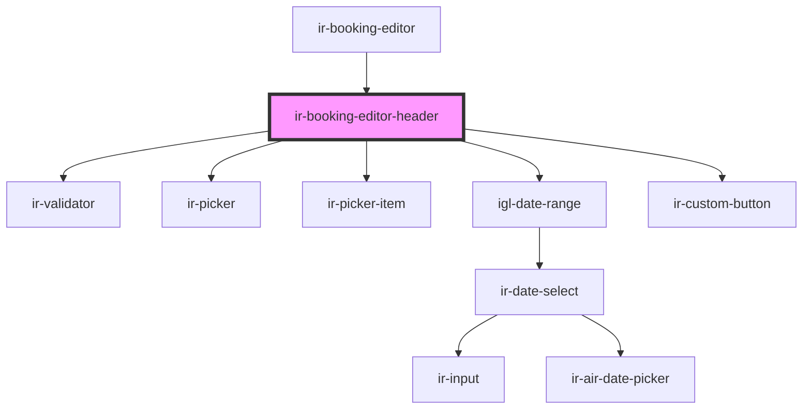

# ir-booking-editor-header

<!-- Auto Generated Below -->

## Properties

| Property            | Attribute             | Description                                              | Type                                                                                 | Default          |
| ------------------- | --------------------- | -------------------------------------------------------- | ------------------------------------------------------------------------------------ | ---------------- |
| `booking`           | --                    | Booking context used for edit, add-room, and split flows | `Booking`                                                                            | `undefined`      |
| `checkIn`           | `check-in`            | Fixed check-in date (YYYY-MM-DD), if applicable          | `string`                                                                             | `undefined`      |
| `checkOut`          | `check-out`           | Fixed check-out date (YYYY-MM-DD), if applicable         | `string`                                                                             | `undefined`      |
| `isBlockConversion` | `is-block-conversion` |                                                          | `boolean`                                                                            | `undefined`      |
| `isLoading`         | `is-loading`          |                                                          | `boolean`                                                                            | `undefined`      |
| `mode`              | `mode`                | Controls header behavior and date constraints            | `"ADD_ROOM" \| "BAR_BOOKING" \| "EDIT_BOOKING" \| "PLUS_BOOKING" \| "SPLIT_BOOKING"` | `'PLUS_BOOKING'` |

## Events

| Event               | Description | Type                   |
| ------------------- | ----------- | ---------------------- |
| `checkAvailability` |             | `CustomEvent<void>`    |
| `guestSelected`     |             | `CustomEvent<Booking>` |

## Dependencies

### Used by

 - [ir-booking-editor](..)

### Depends on

- [ir-validator](../../../ui/ir-validator)
- [ir-picker](../../../ui/ir-picker)
- [ir-picker-item](../../../ui/ir-picker/ir-picker-item)
- [igl-date-range](../../igl-date-range)
- [ir-custom-button](../../../ui/ir-custom-button)

### Graph

----------------------------------------------

*Built with [StencilJS](https://stenciljs.com/)*
