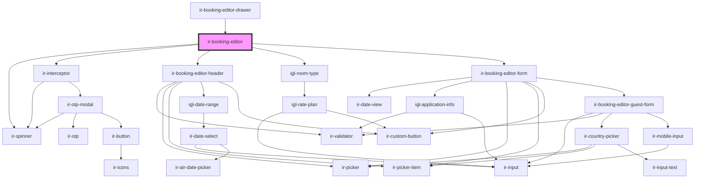

# ir-booking-editor

<!-- Auto Generated Below -->

## Properties

| Property      | Attribute     | Description | Type                                                                                                                                                                    | Default          |
| ------------- | ------------- | ----------- | ----------------------------------------------------------------------------------------------------------------------------------------------------------------------- | ---------------- |
| `blockedUnit` | --            |             | `{ RELEASE_AFTER_HOURS: string; ENTRY_DATE: string; ENTRY_HOUR: number; ENTRY_MINUTE: number; OPTIONAL_REASON: string; STATUS_CODE: string; OUT_OF_SERVICE: boolean; }` | `undefined`      |
| `booking`     | --            |             | `Booking`                                                                                                                                                               | `undefined`      |
| `checkIn`     | `check-in`    |             | `string`                                                                                                                                                                | `undefined`      |
| `checkOut`    | `check-out`   |             | `string`                                                                                                                                                                | `undefined`      |
| `identifier`  | `identifier`  |             | `string`                                                                                                                                                                | `undefined`      |
| `language`    | `language`    |             | `string`                                                                                                                                                                | `'en'`           |
| `mode`        | `mode`        |             | `"ADD_ROOM" \| "BAR_BOOKING" \| "EDIT_BOOKING" \| "PLUS_BOOKING" \| "SPLIT_BOOKING"`                                                                                    | `'PLUS_BOOKING'` |
| `propertyId`  | `property-id` |             | `number \| string`                                                                                                                                                      | `undefined`      |
| `roomTypeIds` | --            |             | `(string \| number)[]`                                                                                                                                                  | `[]`             |
| `step`        | `step`        |             | `"confirm" \| "details"`                                                                                                                                                | `undefined`      |
| `unitId`      | `unit-id`     |             | `string`                                                                                                                                                                | `undefined`      |

## Events

| Event               | Description | Type                              |
| ------------------- | ----------- | --------------------------------- |
| `adjustBlockedUnit` |             | `CustomEvent<any>`                |
| `loadingChanged`    |             | `CustomEvent<{ cause: string; }>` |
| `resetBookingEvt`   |             | `CustomEvent<void>`               |

## Dependencies

### Used by

 - [ir-booking-editor-drawer](ir-booking-editor-drawer)

### Depends on

- [ir-spinner](../../ui/ir-spinner)
- [ir-interceptor](../../ir-interceptor)
- [ir-booking-editor-header](ir-booking-editor-header)
- [igl-room-type](../igl-book-property/igl-booking-overview-page/igl-room-type)
- [ir-booking-editor-form](ir-booking-editor-form)

### Graph

----------------------------------------------

*Built with [StencilJS](https://stenciljs.com/)*
