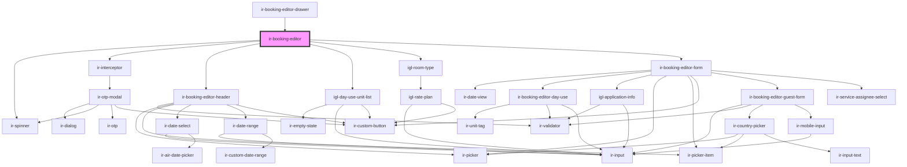

# ir-booking-editor

<!-- Auto Generated Below -->

## Properties

| Property       | Attribute     | Description                                                                                                                                                                                                           | Type                                                                                                                                                                                                                                                                                                                                                                                                                                                                                                                                                                                                                                                                                                                                                                                                                                                                                                                                                                                                                                                                                                                                                                                                                                                                                                                                            | Default          |
| -------------- | ------------- | --------------------------------------------------------------------------------------------------------------------------------------------------------------------------------------------------------------------- | ----------------------------------------------------------------------------------------------------------------------------------------------------------------------------------------------------------------------------------------------------------------------------------------------------------------------------------------------------------------------------------------------------------------------------------------------------------------------------------------------------------------------------------------------------------------------------------------------------------------------------------------------------------------------------------------------------------------------------------------------------------------------------------------------------------------------------------------------------------------------------------------------------------------------------------------------------------------------------------------------------------------------------------------------------------------------------------------------------------------------------------------------------------------------------------------------------------------------------------------------------------------------------------------------------------------------------------------------- | ---------------- |
| `blockedUnit`  | --            |                                                                                                                                                                                                                       | `{ RELEASE_AFTER_HOURS: string; ENTRY_DATE: string; ENTRY_HOUR: number; ENTRY_MINUTE: number; OPTIONAL_REASON: string; STATUS_CODE: string; OUT_OF_SERVICE: boolean; }`                                                                                                                                                                                                                                                                                                                                                                                                                                                                                                                                                                                                                                                                                                                                                                                                                                                                                                                                                                                                                                                                                                                                                                         | `undefined`      |
| `booking`      | --            |                                                                                                                                                                                                                       | `Booking`                                                                                                                                                                                                                                                                                                                                                                                                                                                                                                                                                                                                                                                                                                                                                                                                                                                                                                                                                                                                                                                                                                                                                                                                                                                                                                                                       | `undefined`      |
| `checkIn`      | `check-in`    |                                                                                                                                                                                                                       | `string`                                                                                                                                                                                                                                                                                                                                                                                                                                                                                                                                                                                                                                                                                                                                                                                                                                                                                                                                                                                                                                                                                                                                                                                                                                                                                                                                        | `undefined`      |
| `checkOut`     | `check-out`   |                                                                                                                                                                                                                       | `string`                                                                                                                                                                                                                                                                                                                                                                                                                                                                                                                                                                                                                                                                                                                                                                                                                                                                                                                                                                                                                                                                                                                                                                                                                                                                                                                                        | `undefined`      |
| `extraService` | --            | The day-use extra service being edited (`mode="EDIT_DAY_USE"`) — its unit is excluded from the "already booked" filter, highlighted in the unit list, and updated in place via `doBookingExtraService` on submission. | `{ description?: string; currency_id?: number; agent?: { name?: string; id?: number; email?: string; property_id?: any; code?: string; address?: string; agent_rate_type_code?: { code?: string; description?: string; }; agent_type_code?: { code?: string; description?: string; }; city?: string; contact_name?: string; contract_nbr?: any; country_id?: number; currency_id?: any; due_balance?: any; email_copied_upon_booking?: string; is_active?: boolean; is_send_guest_confirmation_email?: boolean; notes?: string; payment_mode?: { code?: string; description?: string; }; phone?: string; provided_discount?: any; question?: string; sort_order?: any; tax_nbr?: string; reference?: string; verification_mode?: string; has_opening_balance?: boolean; cl_post_timing?: { code?: string; description?: string; }; pr_id?: number; }; system_id?: number; room_identifier?: string; booking_system_id?: number; cost?: number; end_date?: string; start_date?: string; price?: number; category?: { code?: string; }; pr_id?: number; from_time?: string; to_time?: string; charges?: { city_tax_amount?: number; city_tax_percent?: number; net_amount?: number; service_charge_amount?: number; service_charge_percent?: number; tax_amount?: number; total_amount?: number; vat_amount?: number; vat_percent?: number; }; }` | `undefined`      |
| `identifier`   | `identifier`  |                                                                                                                                                                                                                       | `string`                                                                                                                                                                                                                                                                                                                                                                                                                                                                                                                                                                                                                                                                                                                                                                                                                                                                                                                                                                                                                                                                                                                                                                                                                                                                                                                                        | `undefined`      |
| `language`     | `language`    |                                                                                                                                                                                                                       | `string`                                                                                                                                                                                                                                                                                                                                                                                                                                                                                                                                                                                                                                                                                                                                                                                                                                                                                                                                                                                                                                                                                                                                                                                                                                                                                                                                        | `'en'`           |
| `mode`         | `mode`        |                                                                                                                                                                                                                       | `"ADD_ROOM" \| "BAR_BOOKING" \| "EDIT_BOOKING" \| "EDIT_DAY_USE" \| "PLUS_BOOKING" \| "SPLIT_BOOKING"`                                                                                                                                                                                                                                                                                                                                                                                                                                                                                                                                                                                                                                                                                                                                                                                                                                                                                                                                                                                                                                                                                                                                                                                                                                          | `'PLUS_BOOKING'` |
| `propertyId`   | `property-id` |                                                                                                                                                                                                                       | `number \| string`                                                                                                                                                                                                                                                                                                                                                                                                                                                                                                                                                                                                                                                                                                                                                                                                                                                                                                                                                                                                                                                                                                                                                                                                                                                                                                                              | `undefined`      |
| `roomTypeIds`  | --            |                                                                                                                                                                                                                       | `(string \| number)[]`                                                                                                                                                                                                                                                                                                                                                                                                                                                                                                                                                                                                                                                                                                                                                                                                                                                                                                                                                                                                                                                                                                                                                                                                                                                                                                                          | `[]`             |
| `step`         | `step`        |                                                                                                                                                                                                                       | `"confirm" \| "details"`                                                                                                                                                                                                                                                                                                                                                                                                                                                                                                                                                                                                                                                                                                                                                                                                                                                                                                                                                                                                                                                                                                                                                                                                                                                                                                                        | `undefined`      |
| `unitId`       | `unit-id`     |                                                                                                                                                                                                                       | `string`                                                                                                                                                                                                                                                                                                                                                                                                                                                                                                                                                                                                                                                                                                                                                                                                                                                                                                                                                                                                                                                                                                                                                                                                                                                                                                                                        | `undefined`      |

## Events

| Event               | Description | Type                                            |
| ------------------- | ----------- | ----------------------------------------------- |
| `adjustBlockedUnit` |             | `CustomEvent<any>`                              |
| `bookingStepChange` |             | `CustomEvent<{ direction: "next" \| "prev"; }>` |
| `loadingChanged`    |             | `CustomEvent<{ cause: string; }>`               |
| `preventPageLoad`   |             | `CustomEvent<string>`                           |
| `resetBookingEvt`   |             | `CustomEvent<Booking>`                          |

## Dependencies

### Used by

 - [ir-booking-editor-drawer](ir-booking-editor-drawer)

### Depends on

- [ir-spinner](../../ui/ir-spinner)
- [ir-interceptor](../../ir-interceptor)
- [ir-booking-editor-header](ir-booking-editor-header)
- [igl-day-use-unit-list](igl-day-use-unit-list)
- [igl-room-type](../igl-book-property/igl-booking-overview-page/igl-room-type)
- [ir-booking-editor-form](ir-booking-editor-form)

### Graph

```mermaid
graph TD;
  ir-booking-editor --> ir-spinner
  ir-booking-editor --> ir-interceptor
  ir-booking-editor --> ir-booking-editor-header
  ir-booking-editor --> igl-day-use-unit-list
  ir-booking-editor --> igl-room-type
  ir-booking-editor --> ir-booking-editor-form
  ir-interceptor --> ir-otp-modal
  ir-otp-modal --> ir-dialog
  ir-otp-modal --> ir-spinner
  ir-otp-modal --> ir-otp
  ir-otp-modal --> ir-custom-button
  ir-booking-editor-header --> ir-validator
  ir-booking-editor-header --> ir-picker
  ir-booking-editor-header --> ir-picker-item
  ir-booking-editor-header --> ir-date-select
  ir-booking-editor-header --> ir-date-range
  ir-booking-editor-header --> ir-custom-button
  ir-date-select --> ir-input
  ir-date-select --> ir-air-date-picker
  ir-date-range --> ir-input
  ir-date-range --> ir-custom-date-range
  igl-day-use-unit-list --> ir-empty-state
  igl-day-use-unit-list --> ir-input
  igl-day-use-unit-list --> ir-custom-button
  igl-room-type --> igl-rate-plan
  igl-rate-plan --> ir-input
  igl-rate-plan --> ir-custom-button
  ir-booking-editor-form --> ir-date-view
  ir-booking-editor-form --> ir-booking-editor-day-use
  ir-booking-editor-form --> igl-application-info
  ir-booking-editor-form --> ir-picker
  ir-booking-editor-form --> ir-picker-item
  ir-booking-editor-form --> ir-custom-button
  ir-booking-editor-form --> ir-booking-editor-guest-form
  ir-booking-editor-form --> ir-service-assignee-select
  ir-booking-editor-day-use --> ir-unit-tag
  ir-booking-editor-day-use --> ir-validator
  ir-booking-editor-day-use --> ir-input
  igl-application-info --> ir-validator
  igl-application-info --> ir-input
  ir-booking-editor-guest-form --> ir-input
  ir-booking-editor-guest-form --> ir-validator
  ir-booking-editor-guest-form --> ir-country-picker
  ir-booking-editor-guest-form --> ir-mobile-input
  ir-country-picker --> ir-picker
  ir-country-picker --> ir-picker-item
  ir-country-picker --> ir-input-text
  ir-mobile-input --> ir-input
  ir-booking-editor-drawer --> ir-booking-editor
  style ir-booking-editor fill:#f9f,stroke:#333,stroke-width:4px
```

----------------------------------------------

*Built with [StencilJS](https://stenciljs.com/)*
