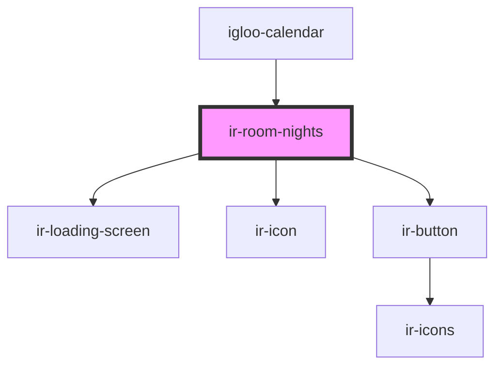

# ir-room-nights

<!-- Auto Generated Below -->

## Properties

| Property        | Attribute        | Description | Type                                      | Default     |
| --------------- | ---------------- | ----------- | ----------------------------------------- | ----------- |
| `bookingNumber` | `booking-number` |             | `string`                                  | `undefined` |
| `defaultDates`  | --               |             | `{ from_date: string; to_date: string; }` | `undefined` |
| `fromDate`      | `from-date`      |             | `string`                                  | `undefined` |
| `identifier`    | `identifier`     |             | `string`                                  | `undefined` |
| `language`      | `language`       |             | `string`                                  | `undefined` |
| `pool`          | `pool`           |             | `string`                                  | `undefined` |
| `propertyId`    | `property-id`    |             | `number`                                  | `undefined` |
| `ticket`        | `ticket`         |             | `string`                                  | `undefined` |
| `toDate`        | `to-date`        |             | `string`                                  | `undefined` |

## Events

| Event                   | Description | Type                                       |
| ----------------------- | ----------- | ------------------------------------------ |
| `closeRoomNightsDialog` |             | `CustomEvent<IRoomNightsDataEventPayload>` |

## Dependencies

### Used by

 - [igloo-calendar](..)

### Depends on

- [ir-loading-screen](../../ir-loading-screen)
- [ir-icon](../../ir-icon)
- [ir-button](../../ir-button)

### Graph

----------------------------------------------

*Built with [StencilJS](https://stenciljs.com/)*
