# igloo-calendar

<!-- Auto Generated Below -->

## Properties

| Property         | Attribute         | Description | Type     | Default     |
| ---------------- | ----------------- | ----------- | -------- | ----------- |
| `baseUrl`        | `base-url`        |             | `string` | `undefined` |
| `currencyName`   | `currency-name`   |             | `string` | `undefined` |
| `from_date`      | `from_date`       |             | `string` | `undefined` |
| `language`       | `language`        |             | `string` | `undefined` |
| `loadingMessage` | `loading-message` |             | `string` | `undefined` |
| `p`              | `p`               |             | `string` | `undefined` |
| `propertyid`     | `propertyid`      |             | `number` | `undefined` |
| `ticket`         | `ticket`          |             | `string` | `''`        |
| `to_date`        | `to_date`         |             | `string` | `undefined` |

## Events

| Event                      | Description | Type                                                                                                                 |
| -------------------------- | ----------- | -------------------------------------------------------------------------------------------------------------------- |
| `calculateUnassignedDates` |             | `CustomEvent<any>`                                                                                                   |
| `dragOverHighlightElement` |             | `CustomEvent<any>`                                                                                                   |
| `moveBookingTo`            |             | `CustomEvent<any>`                                                                                                   |
| `openCalendarSidebar`      |             | `CustomEvent<{ type: "split" \| "room-guests" \| "booking-details" \| "add-days" \| "bulk-blocks"; payload: any; }>` |
| `reduceAvailableUnitEvent` |             | `CustomEvent<{ fromDate: string; toDate: string; }>`                                                                 |
| `revertBooking`            |             | `CustomEvent<any>`                                                                                                   |
| `showRoomNightsDialog`     |             | `CustomEvent<IRoomNightsData>`                                                                                       |

## Dependencies

### Used by

 - [ir-secure-tasks](../ir-secure-tasks)

### Depends on

- [ir-toast](../ui/ir-toast)
- [ir-interceptor](../ir-interceptor)
- [igl-to-be-assigned](igl-to-be-assigned)
- [igl-legends](igl-legends)
- [igl-cal-header](igl-cal-header)
- [igl-cal-body](igl-cal-body)
- [igl-cal-footer](igl-cal-footer)
- [ir-loading-screen](../ir-loading-screen)
- [igl-book-property](igl-book-property)
- [ir-sidebar](../ui/ir-sidebar)
- [ir-room-nights](ir-room-nights)
- [igl-split-booking](igl-split-booking)
- [ir-booking-details](../ir-booking-details)
- [ir-room-guests](../ir-booking-details/ir-room-guests)
- [igl-bulk-operations](igl-bulk-operations)
- [igl-reallocation-dialog](igl-reallocation-dialog)
- [ir-modal](../ui/ir-modal)

### Graph

```mermaid
graph TD;
  igloo-calendar --> ir-toast
  igloo-calendar --> ir-interceptor
  igloo-calendar --> igl-to-be-assigned
  igloo-calendar --> igl-legends
  igloo-calendar --> igl-cal-header
  igloo-calendar --> igl-cal-body
  igloo-calendar --> igl-cal-footer
  igloo-calendar --> ir-loading-screen
  igloo-calendar --> igl-book-property
  igloo-calendar --> ir-sidebar
  igloo-calendar --> ir-room-nights
  igloo-calendar --> igl-split-booking
  igloo-calendar --> ir-booking-details
  igloo-calendar --> ir-room-guests
  igloo-calendar --> igl-bulk-operations
  igloo-calendar --> igl-reallocation-dialog
  igloo-calendar --> ir-modal
  ir-interceptor --> ir-otp-modal
  ir-otp-modal --> ir-spinner
  ir-otp-modal --> ir-otp
  ir-otp-modal --> ir-button
  ir-button --> ir-icons
  igl-to-be-assigned --> igl-tba-category-view
  igl-to-be-assigned --> ir-button
  igl-tba-category-view --> igl-tba-booking-view
  igl-tba-booking-view --> ir-button
  igl-legends --> ir-new-badge
  igl-legends --> ir-input-text
  igl-legends --> ir-success-loader
  ir-success-loader --> ir-icons
  igl-cal-header --> ir-button
  igl-cal-header --> ir-date-picker
  igl-cal-header --> ir-m-combobox
  igl-cal-body --> ir-interactive-title
  igl-cal-body --> igl-booking-event
  igl-cal-body --> ir-modal
  igl-booking-event --> igl-booking-event-hover
  igl-booking-event-hover --> ir-dropdown
  igl-booking-event-hover --> ir-icons
  igl-booking-event-hover --> ir-dropdown-item
  igl-booking-event-hover --> ir-date-view
  igl-booking-event-hover --> ir-label
  igl-booking-event-hover --> ir-button
  igl-booking-event-hover --> igl-block-dates-view
  ir-dropdown --> ir-icons
  igl-block-dates-view --> ir-date-view
  ir-modal --> ir-button
  igl-cal-footer --> ir-new-badge
  igl-book-property --> igl-block-dates-view
  igl-book-property --> ir-spinner
  igl-book-property --> ir-icon
  igl-book-property --> igl-booking-overview-page
  igl-book-property --> igl-booking-form
  igl-book-property --> ir-button
  igl-book-property --> igl-book-property-footer
  igl-booking-overview-page --> igl-book-property-header
  igl-booking-overview-page --> igl-room-type
  igl-book-property-header --> ir-autocomplete
  igl-book-property-header --> ir-select
  igl-book-property-header --> ir-button
  igl-book-property-header --> igl-date-range
  igl-date-range --> ir-date-range
  igl-room-type --> igl-rate-plan
  igl-rate-plan --> ir-tooltip
  igl-rate-plan --> ir-price-input
  igl-booking-form --> ir-date-view
  igl-booking-form --> igl-application-info
  igl-booking-form --> igl-property-booked-by
  igl-application-info --> ir-tooltip
  igl-property-booked-by --> ir-autocomplete
  igl-property-booked-by --> ir-tooltip
  igl-property-booked-by --> ir-country-picker
  igl-property-booked-by --> ir-phone-input
  igl-property-booked-by --> ir-select
  ir-country-picker --> ir-input-text
  ir-phone-input --> ir-combobox
  igl-book-property-footer --> ir-button
  ir-sidebar --> ir-icon
  ir-room-nights --> ir-price-input
  ir-room-nights --> ir-loading-screen
  ir-room-nights --> ir-title
  ir-room-nights --> ir-button
  ir-title --> ir-icon
  igl-split-booking --> ir-title
  igl-split-booking --> ir-date-view
  igl-split-booking --> ir-date-picker
  igl-split-booking --> ir-button
  igl-split-booking --> ir-radio
  igl-split-booking --> ir-select
  ir-booking-details --> ir-guest-info
  ir-booking-details --> ir-pickup
  ir-booking-details --> ir-booking-extra-note
  ir-booking-details --> ir-extra-service-config
  ir-booking-details --> ir-room-guests
  ir-booking-details --> ir-payment-folio
  ir-booking-details --> ir-room
  ir-booking-details --> ir-spinner
  ir-booking-details --> ir-toast
  ir-booking-details --> ir-interceptor
  ir-booking-details --> ir-booking-header
  ir-booking-details --> ir-reservation-information
  ir-booking-details --> ir-date-view
  ir-booking-details --> ir-button
  ir-booking-details --> ir-pickup-view
  ir-booking-details --> ir-extra-services
  ir-booking-details --> ir-payment-details
  ir-booking-details --> ir-modal
  ir-booking-details --> ir-sidebar
  ir-booking-details --> igl-book-property
  ir-guest-info --> ir-spinner
  ir-guest-info --> ir-toast
  ir-guest-info --> ir-interceptor
  ir-guest-info --> ir-title
  ir-guest-info --> ir-input-text
  ir-guest-info --> ir-country-picker
  ir-guest-info --> ir-phone-input
  ir-guest-info --> ir-textarea
  ir-guest-info --> ir-button
  ir-pickup --> ir-title
  ir-pickup --> ir-select
  ir-pickup --> ir-date-picker
  ir-pickup --> ir-input-text
  ir-pickup --> ir-price-input
  ir-pickup --> ir-button
  ir-booking-extra-note --> ir-title
  ir-booking-extra-note --> ir-textarea
  ir-booking-extra-note --> ir-button
  ir-extra-service-config --> ir-title
  ir-extra-service-config --> ir-date-picker
  ir-extra-service-config --> ir-button
  ir-extra-service-config --> ir-price-input
  ir-room-guests --> ir-spinner
  ir-room-guests --> ir-title
  ir-room-guests --> ir-input-text
  ir-room-guests --> ir-country-picker
  ir-room-guests --> ir-select
  ir-room-guests --> ir-button
  ir-payment-folio --> ir-dropdown-item
  ir-payment-folio --> ir-title
  ir-payment-folio --> ir-date-picker
  ir-payment-folio --> ir-dropdown
  ir-payment-folio --> ir-price-input
  ir-payment-folio --> ir-input-text
  ir-payment-folio --> ir-button
  ir-room --> ir-button
  ir-room --> ir-date-view
  ir-room --> ir-tooltip
  ir-room --> ir-select
  ir-room --> ir-label
  ir-room --> ir-modal
  ir-booking-header --> ir-pms-logs
  ir-booking-header --> ir-events-log
  ir-booking-header --> ir-popover
  ir-booking-header --> ir-select
  ir-booking-header --> ir-button
  ir-booking-header --> ir-dialog
  ir-booking-header --> ir-modal
  ir-pms-logs --> ir-spinner
  ir-events-log --> ir-spinner
  ir-reservation-information --> ir-label
  ir-reservation-information --> ir-tooltip
  ir-reservation-information --> ir-icons
  ir-reservation-information --> ir-button
  ir-reservation-information --> ota-label
  ir-pickup-view --> ir-button
  ir-extra-services --> ir-extra-service
  ir-extra-service --> ir-button
  ir-extra-service --> ir-date-view
  ir-extra-service --> ir-modal
  ir-payment-details --> ir-payment-summary
  ir-payment-details --> ir-booking-guarantee
  ir-payment-details --> ir-applicable-policies
  ir-payment-details --> ir-button
  ir-payment-details --> ir-payments-folio
  ir-payment-details --> ir-modal
  ir-booking-guarantee --> ir-label
  ir-booking-guarantee --> ir-button
  ir-applicable-policies --> ir-button
  ir-applicable-policies --> ir-icons
  ir-payments-folio --> ir-payment-item
  ir-payments-folio --> ir-button
  ir-payment-item --> ir-popover
  ir-payment-item --> ir-button
  igl-bulk-operations --> ir-title
  igl-bulk-operations --> ir-tabs
  igl-bulk-operations --> igl-bulk-stop-sale
  igl-bulk-operations --> igl-bulk-block
  igl-bulk-stop-sale --> ir-select
  igl-bulk-stop-sale --> ir-weekday-selector
  igl-bulk-stop-sale --> ir-button
  igl-bulk-stop-sale --> ir-date-picker
  ir-weekday-selector --> ir-checkbox
  igl-bulk-block --> ir-select
  igl-bulk-block --> ir-radio
  igl-bulk-block --> ir-button
  igl-bulk-block --> ir-date-picker
  igl-reallocation-dialog --> ir-dialog
  igl-reallocation-dialog --> ir-select
  igl-reallocation-dialog --> ir-button
  ir-secure-tasks --> igloo-calendar
  style igloo-calendar fill:#f9f,stroke:#333,stroke-width:4px
```

----------------------------------------------

*Built with [StencilJS](https://stenciljs.com/)*
