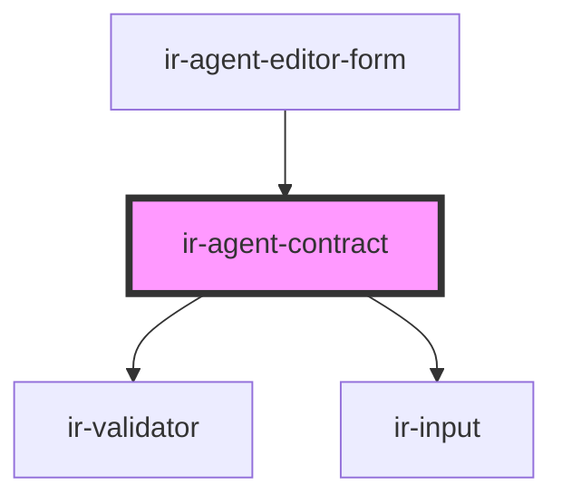

# ir-agent-contract

<!-- Auto Generated Below -->

## Properties

| Property       | Attribute | Description | Type                                                                                                                                                                                                                                                                                                                                                                                                                                                                                                                                                                                                                                                                                  | Default     |
| -------------- | --------- | ----------- | ------------------------------------------------------------------------------------------------------------------------------------------------------------------------------------------------------------------------------------------------------------------------------------------------------------------------------------------------------------------------------------------------------------------------------------------------------------------------------------------------------------------------------------------------------------------------------------------------------------------------------------------------------------------------------------- | ----------- |
| `agent`        | --        |             | `{ name?: string; email?: string; id?: number; reference?: string; address?: string; code?: string; notes?: string; is_active?: boolean; property_id?: any; country_id?: number; currency_id?: any; city?: string; agent_rate_type_code?: { code?: string; description?: string; }; agent_type_code?: { code?: string; description?: string; }; contact_name?: string; contract_nbr?: any; due_balance?: any; email_copied_upon_booking?: string; is_send_guest_confirmation_email?: boolean; payment_mode?: { code?: string; description?: string; }; phone?: string; provided_discount?: any; question?: string; sort_order?: any; tax_nbr?: string; verification_mode?: string; }` | `undefined` |
| `setupEntries` | --        |             | `{ agent_rate_type: IEntries[]; agent_type: IEntries[]; ta_payment_method: IEntries[]; }`                                                                                                                                                                                                                                                                                                                                                                                                                                                                                                                                                                                             | `undefined` |

## Events

| Event               | Description | Type                                                                                                                                                                                                                                                                                                                                                                                                                                                                                                                                                                                                                                                                                               |
| ------------------- | ----------- | -------------------------------------------------------------------------------------------------------------------------------------------------------------------------------------------------------------------------------------------------------------------------------------------------------------------------------------------------------------------------------------------------------------------------------------------------------------------------------------------------------------------------------------------------------------------------------------------------------------------------------------------------------------------------------------------------- |
| `agentFieldChanged` |             | `CustomEvent<{ name?: string; email?: string; id?: number; reference?: string; address?: string; code?: string; notes?: string; is_active?: boolean; property_id?: any; country_id?: number; currency_id?: any; city?: string; agent_rate_type_code?: { code?: string; description?: string; }; agent_type_code?: { code?: string; description?: string; }; contact_name?: string; contract_nbr?: any; due_balance?: any; email_copied_upon_booking?: string; is_send_guest_confirmation_email?: boolean; payment_mode?: { code?: string; description?: string; }; phone?: string; provided_discount?: any; question?: string; sort_order?: any; tax_nbr?: string; verification_mode?: string; }>` |

## Dependencies

### Used by

 - [ir-agent-editor-form](../ir-agent-editor-form)

### Depends on

- [ir-validator](../../../ui/ir-validator)
- [ir-input](../../../ui/ir-input)

### Graph

----------------------------------------------

*Built with [StencilJS](https://stenciljs.com/)*
