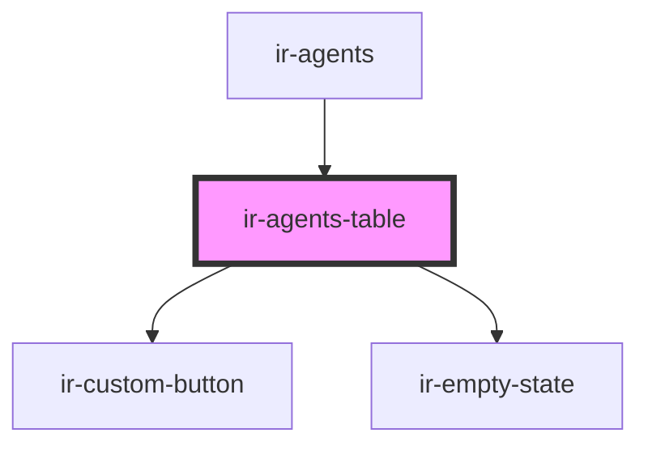

# ir-agents-table

<!-- Auto Generated Below -->

## Properties

| Property       | Attribute  | Description | Type                                                                                                                                                                                                                                                                                                                                                                                                                                                                                                                                                                                                                                                                                    | Default     |
| -------------- | ---------- | ----------- | --------------------------------------------------------------------------------------------------------------------------------------------------------------------------------------------------------------------------------------------------------------------------------------------------------------------------------------------------------------------------------------------------------------------------------------------------------------------------------------------------------------------------------------------------------------------------------------------------------------------------------------------------------------------------------------- | ----------- |
| `agents`       | --         |             | `{ name?: string; email?: string; id?: number; reference?: string; address?: string; code?: string; notes?: string; is_active?: boolean; property_id?: any; country_id?: number; currency_id?: any; city?: string; agent_rate_type_code?: { code?: string; description?: string; }; agent_type_code?: { code?: string; description?: string; }; contact_name?: string; contract_nbr?: any; due_balance?: any; email_copied_upon_booking?: string; is_send_guest_confirmation_email?: boolean; payment_mode?: { code?: string; description?: string; }; phone?: string; provided_discount?: any; question?: string; sort_order?: any; tax_nbr?: string; verification_mode?: string; }[]` | `[]`        |
| `countries`    | --         |             | `ICountry[]`                                                                                                                                                                                                                                                                                                                                                                                                                                                                                                                                                                                                                                                                            | `undefined` |
| `language`     | `language` |             | `string`                                                                                                                                                                                                                                                                                                                                                                                                                                                                                                                                                                                                                                                                                | `undefined` |
| `setupEntries` | --         |             | `{ agent_rate_type: IEntries[]; agent_type: IEntries[]; ta_payment_method: IEntries[]; }`                                                                                                                                                                                                                                                                                                                                                                                                                                                                                                                                                                                               | `undefined` |

## Events

| Event               | Description | Type                                                                                                                                                                                                                                                                                                                                                                                                                                                                                                                                                                                                                                                                                               |
| ------------------- | ----------- | -------------------------------------------------------------------------------------------------------------------------------------------------------------------------------------------------------------------------------------------------------------------------------------------------------------------------------------------------------------------------------------------------------------------------------------------------------------------------------------------------------------------------------------------------------------------------------------------------------------------------------------------------------------------------------------------------- |
| `deleteAgent`       |             | `CustomEvent<{ name?: string; email?: string; id?: number; reference?: string; address?: string; code?: string; notes?: string; is_active?: boolean; property_id?: any; country_id?: number; currency_id?: any; city?: string; agent_rate_type_code?: { code?: string; description?: string; }; agent_type_code?: { code?: string; description?: string; }; contact_name?: string; contract_nbr?: any; due_balance?: any; email_copied_upon_booking?: string; is_send_guest_confirmation_email?: boolean; payment_mode?: { code?: string; description?: string; }; phone?: string; provided_discount?: any; question?: string; sort_order?: any; tax_nbr?: string; verification_mode?: string; }>` |
| `toggleAgentActive` |             | `CustomEvent<{ name?: string; email?: string; id?: number; reference?: string; address?: string; code?: string; notes?: string; is_active?: boolean; property_id?: any; country_id?: number; currency_id?: any; city?: string; agent_rate_type_code?: { code?: string; description?: string; }; agent_type_code?: { code?: string; description?: string; }; contact_name?: string; contract_nbr?: any; due_balance?: any; email_copied_upon_booking?: string; is_send_guest_confirmation_email?: boolean; payment_mode?: { code?: string; description?: string; }; phone?: string; provided_discount?: any; question?: string; sort_order?: any; tax_nbr?: string; verification_mode?: string; }>` |
| `upsertAgent`       |             | `CustomEvent<{ name?: string; email?: string; id?: number; reference?: string; address?: string; code?: string; notes?: string; is_active?: boolean; property_id?: any; country_id?: number; currency_id?: any; city?: string; agent_rate_type_code?: { code?: string; description?: string; }; agent_type_code?: { code?: string; description?: string; }; contact_name?: string; contract_nbr?: any; due_balance?: any; email_copied_upon_booking?: string; is_send_guest_confirmation_email?: boolean; payment_mode?: { code?: string; description?: string; }; phone?: string; provided_discount?: any; question?: string; sort_order?: any; tax_nbr?: string; verification_mode?: string; }>` |

## Dependencies

### Used by

 - [ir-agents](..)

### Depends on

- [ir-custom-button](../../ui/ir-custom-button)
- [ir-empty-state](../../ir-empty-state)

### Graph

----------------------------------------------

*Built with [StencilJS](https://stenciljs.com/)*
