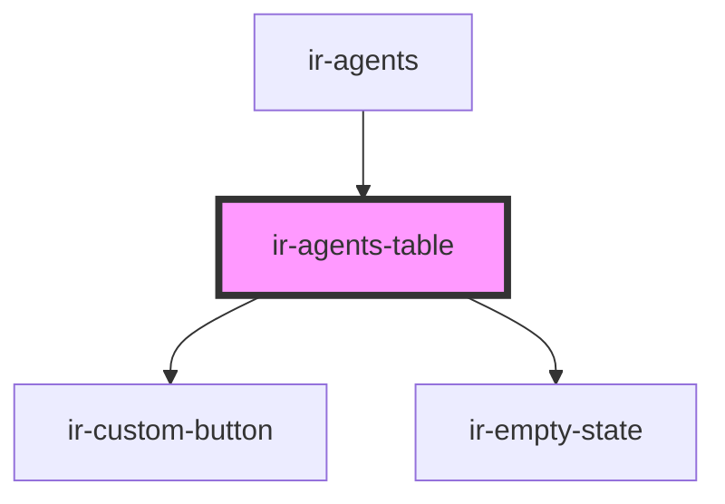

# ir-agents-table

<!-- Auto Generated Below -->

## Properties

| Property       | Attribute  | Description | Type                                                                                                                                                                                                                                                                                                                                                                                                                                                                                                                                                                                                                                                                                                                                                                              | Default     |
| -------------- | ---------- | ----------- | --------------------------------------------------------------------------------------------------------------------------------------------------------------------------------------------------------------------------------------------------------------------------------------------------------------------------------------------------------------------------------------------------------------------------------------------------------------------------------------------------------------------------------------------------------------------------------------------------------------------------------------------------------------------------------------------------------------------------------------------------------------------------------- | ----------- |
| `agents`       | --         |             | `{ name?: string; id?: number; email?: string; property_id?: any; code?: string; address?: string; agent_rate_type_code?: { code?: string; description?: string; }; agent_type_code?: { code?: string; description?: string; }; city?: string; contact_name?: string; contract_nbr?: any; country_id?: number; currency_id?: any; due_balance?: any; email_copied_upon_booking?: string; is_active?: boolean; is_send_guest_confirmation_email?: boolean; notes?: string; payment_mode?: { code?: string; description?: string; }; phone?: string; provided_discount?: any; question?: string; sort_order?: any; tax_nbr?: string; reference?: string; verification_mode?: string; has_opening_balance?: boolean; cl_post_timing?: { code?: string; description?: string; }; }[]` | `[]`        |
| `countries`    | --         |             | `ICountry[]`                                                                                                                                                                                                                                                                                                                                                                                                                                                                                                                                                                                                                                                                                                                                                                      | `undefined` |
| `language`     | `language` |             | `string`                                                                                                                                                                                                                                                                                                                                                                                                                                                                                                                                                                                                                                                                                                                                                                          | `undefined` |
| `setupEntries` | --         |             | `{ agent_rate_type: IEntries[]; agent_type: IEntries[]; ta_payment_method: IEntries[]; cl_post_timing: IEntries[]; }`                                                                                                                                                                                                                                                                                                                                                                                                                                                                                                                                                                                                                                                             | `undefined` |

## Events

| Event               | Description | Type                                                                                                                                                                                                                                                                                                                                                                                                                                                                                                                                                                                                                                                                                                                                                                                         |
| ------------------- | ----------- | -------------------------------------------------------------------------------------------------------------------------------------------------------------------------------------------------------------------------------------------------------------------------------------------------------------------------------------------------------------------------------------------------------------------------------------------------------------------------------------------------------------------------------------------------------------------------------------------------------------------------------------------------------------------------------------------------------------------------------------------------------------------------------------------- |
| `deleteAgent`       |             | `CustomEvent<{ name?: string; id?: number; email?: string; property_id?: any; code?: string; address?: string; agent_rate_type_code?: { code?: string; description?: string; }; agent_type_code?: { code?: string; description?: string; }; city?: string; contact_name?: string; contract_nbr?: any; country_id?: number; currency_id?: any; due_balance?: any; email_copied_upon_booking?: string; is_active?: boolean; is_send_guest_confirmation_email?: boolean; notes?: string; payment_mode?: { code?: string; description?: string; }; phone?: string; provided_discount?: any; question?: string; sort_order?: any; tax_nbr?: string; reference?: string; verification_mode?: string; has_opening_balance?: boolean; cl_post_timing?: { code?: string; description?: string; }; }>` |
| `toggleAgentActive` |             | `CustomEvent<{ name?: string; id?: number; email?: string; property_id?: any; code?: string; address?: string; agent_rate_type_code?: { code?: string; description?: string; }; agent_type_code?: { code?: string; description?: string; }; city?: string; contact_name?: string; contract_nbr?: any; country_id?: number; currency_id?: any; due_balance?: any; email_copied_upon_booking?: string; is_active?: boolean; is_send_guest_confirmation_email?: boolean; notes?: string; payment_mode?: { code?: string; description?: string; }; phone?: string; provided_discount?: any; question?: string; sort_order?: any; tax_nbr?: string; reference?: string; verification_mode?: string; has_opening_balance?: boolean; cl_post_timing?: { code?: string; description?: string; }; }>` |
| `upsertAgent`       |             | `CustomEvent<{ name?: string; id?: number; email?: string; property_id?: any; code?: string; address?: string; agent_rate_type_code?: { code?: string; description?: string; }; agent_type_code?: { code?: string; description?: string; }; city?: string; contact_name?: string; contract_nbr?: any; country_id?: number; currency_id?: any; due_balance?: any; email_copied_upon_booking?: string; is_active?: boolean; is_send_guest_confirmation_email?: boolean; notes?: string; payment_mode?: { code?: string; description?: string; }; phone?: string; provided_discount?: any; question?: string; sort_order?: any; tax_nbr?: string; reference?: string; verification_mode?: string; has_opening_balance?: boolean; cl_post_timing?: { code?: string; description?: string; }; }>` |

## Dependencies

### Used by

 - [ir-agents](..)

### Depends on

- [ir-custom-button](../../ui/ir-custom-button)
- [ir-empty-state](../../ir-empty-state)

### Graph

```mermaid
graph TD;
  ir-agents-table --> ir-custom-button
  ir-agents-table --> ir-empty-state
  ir-agents --> ir-agents-table
  style ir-agents-table fill:#f9f,stroke:#333,stroke-width:4px
```

----------------------------------------------

*Built with [StencilJS](https://stenciljs.com/)*
