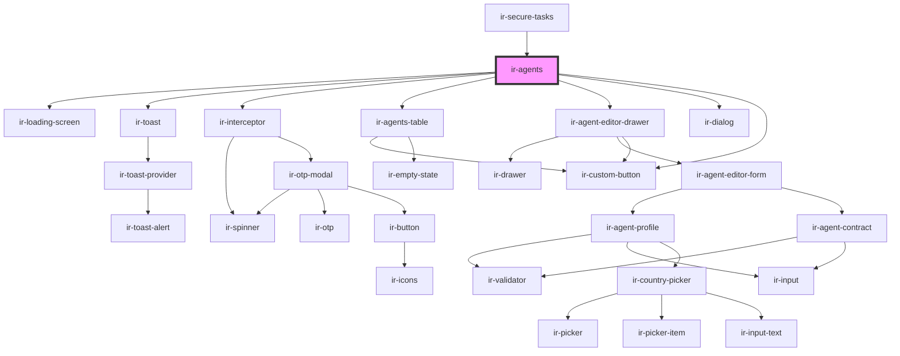

# ir-agents

<!-- Auto Generated Below -->

## Properties

| Property     | Attribute    | Description                                                                                                                           | Type     | Default     |
| ------------ | ------------ | ------------------------------------------------------------------------------------------------------------------------------------- | -------- | ----------- |
| `language`   | `language`   | Two-letter language code (ISO) used for translations and API locale. Defaults to `'en'`.                                              | `string` | `'en'`      |
| `p`          | `p`          | Property alias or short identifier used by backend endpoints (aname). Passed to `getExposedProperty` when initializing the component. | `string` | `undefined` |
| `propertyid` | `propertyid` | ID of the property (hotel) for which arrivals should be displayed. Used in API calls related to rooms, bookings, and check-ins.       | `number` | `undefined` |
| `ticket`     | `ticket`     | Authentication token issued by the PMS backend. Required for initializing the component and making API calls.                         | `string` | `undefined` |

## Events

| Event   | Description | Type                                                                                                 |
| ------- | ----------- | ---------------------------------------------------------------------------------------------------- |
| `toast` |             | `CustomEvent<ICustomToast & Partial<IToastWithButton> \| IDefaultToast & Partial<IToastWithButton>>` |

## Dependencies

### Used by

 - [ir-secure-tasks](../ir-secure-tasks)

### Depends on

- [ir-loading-screen](../ir-loading-screen)
- [ir-toast](../ui/ir-toast)
- [ir-interceptor](../ir-interceptor)
- [ir-agents-table](ir-agents-table)
- [ir-agent-editor-drawer](ir-agent-editor-drawer)
- [ir-dialog](../ui/ir-dialog)
- [ir-custom-button](../ui/ir-custom-button)

### Graph

----------------------------------------------

*Built with [StencilJS](https://stenciljs.com/)*
