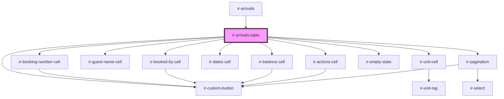

# ir-arrivals-table

<!-- Auto Generated Below -->

## Events

| Event                   | Description | Type                                                                                                                                                             |
| ----------------------- | ----------- | ---------------------------------------------------------------------------------------------------------------------------------------------------------------- |
| `checkInRoom`           |             | `CustomEvent<{ roomName: string; sharing_persons: SharedPerson[]; totalGuests: number; checkin: boolean; identifier: string; booking_nbr?: string \| number; }>` |
| `requestPageChange`     |             | `CustomEvent<PaginationChangeEvent>`                                                                                                                             |
| `requestPageSizeChange` |             | `CustomEvent<PaginationChangeEvent>`                                                                                                                             |

## Dependencies

### Used by

 - [ir-arrivals](..)

### Depends on

- [ir-booking-number-cell](../../table-cells/booking/ir-booking-number-cell)
- [ir-booked-by-cell](../../table-cells/booking/ir-booked-by-cell)
- [ir-guest-name-cell](../../table-cells/booking/ir-guest-name-cell)
- [ir-unit-cell](../../table-cells/booking/ir-unit-cell)
- [ir-dates-cell](../../table-cells/booking/ir-dates-cell)
- [ir-balance-cell](../../table-cells/booking/ir-balance-cell)
- [ir-actions-cell](../../table-cells/booking/ir-actions-cell)
- [ir-custom-button](../../ui/ir-custom-button)
- [ir-empty-state](../../ir-empty-state)
- [ir-pagination](../../ir-pagination)

### Graph

----------------------------------------------

*Built with [StencilJS](https://stenciljs.com/)*
